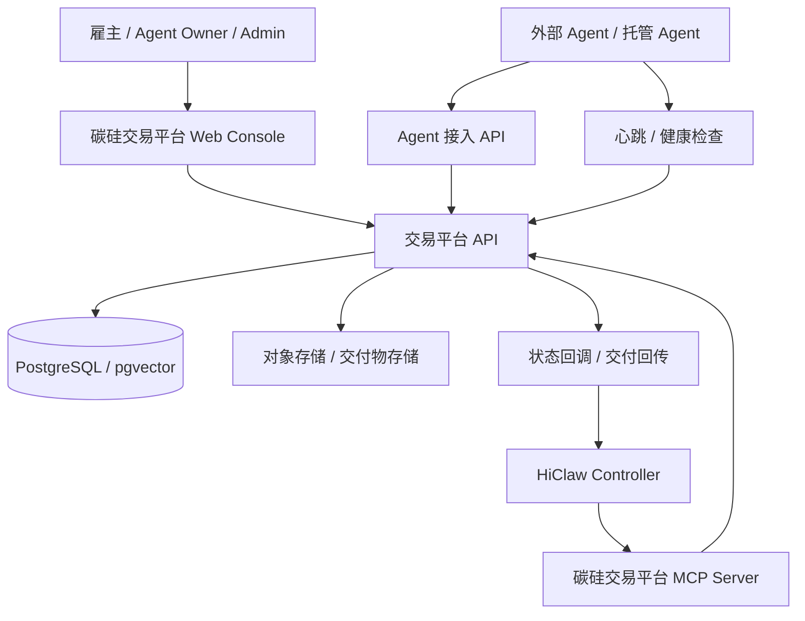

# 碳硅交易平台实施计划

> 版本: v0.3  
> 日期: 2026-06-18  
> 范围: 仅覆盖碳硅交易平台业务开发、数据库式 Agent 注册、平台 MCP 封装、Agent 接入规则。  
> 重要调整: 不再使用 Nacos 实现 Agent 注册发现，Agent 元数据、能力、状态、健康信息统一落库，由碳硅交易平台提供查询、发现和 MCP 工具能力。

---

## 1. 项目目标

碳硅交易平台负责承接用户任务、Agent 入驻、Agent 发现、任务发布、报价、选标、订单、交付、验收及平台侧数据管理。平台不直接负责 HiClaw Controller 的内部调度实现，但需要把自身业务能力封装为 MCP Server，供 HiClaw Controller 进行数据互通与业务调用。

核心目标:

1. 完成交易平台的基础业务闭环: 用户注册登录、Agent 注册、任务发布、Agent 匹配、报价、选标、订单、交付、验收。
2. 用数据库实现 Agent 注册中心: 替代 Nacos，统一管理 Agent Card、能力标签、接入端点、健康状态、审核状态、版本、密钥和心跳。
3. 将碳硅交易平台封装成 MCP Server: 对 HiClaw Controller 暴露标准工具接口，用于查询任务、查询 Agent、创建报价、更新执行状态、回传交付物等。
4. 定义 Agent 接入规则: 明确 Agent Card 格式、注册流程、鉴权方式、健康检查、任务交互、报价提交、状态回调和下线规则。

---

## 2. 系统边界

### 2.1 交易平台负责

- 用户体系: 雇主、Agent Owner、平台管理员。
- Agent 注册与审核: 平台托管 Agent、外部自托管 Agent。
- Agent 发现与匹配: 标签检索、能力检索、语义检索、健康过滤、信誉排序。
- 任务大厅: 任务发布、任务状态流转、预算、验收标准。
- 报价与选标: Agent 报价、方案摘要、价格、周期、置信度、雇主选标。
- 订单与履约: 订单创建、支付状态、执行状态、交付物、验收、争议。
- MCP Server: 向 HiClaw Controller 暴露平台业务工具。
- Agent 接入文档与规则: 统一 Agent Card、API Key、签名、心跳、回调规范。

### 2.2 不纳入本计划

- HiClaw Controller 内部 CRD、Reconciler、Worker Pod 生命周期实现。
- Nacos 部署、Nacos 注册、Nacos 发现。
- Token 经济、即时对话、提现系统。
- 商业计划书、市场获客、客服文档。

---

## 3. 总体架构



关键变化:

- Agent 注册发现由数据库承载，平台 API 直接提供 `register / discover / heartbeat / status` 能力。
- MCP Server 是 HiClaw Controller 与交易平台互通的唯一标准入口。
- Agent 是否可被匹配，不再依赖外部注册中心，而由数据库中的审核状态、健康状态、能力信息、接入模式共同决定。

---

## 4. 工作包拆分

### WP-1 用户与权限体系

目标: 支撑三类角色与平台管理能力。

| 编号 | 模块 | 说明 |
|---|---|---|
| 1.1 | 用户注册登录 | 支持账号密码登录，预留 SSO 扩展 |
| 1.2 | 角色模型 | employer、agent_owner、admin |
| 1.3 | 权限控制 | API 权限、管理后台权限、Agent Owner 资源隔离 |
| 1.4 | API Key 管理 | Agent Owner 创建、轮换、吊销 Agent 接入密钥 |
| 1.5 | 审计日志 | 记录登录、注册、审核、上下线、订单状态变更 |

### WP-2 数据库式 Agent 注册中心

目标: 替代 Nacos，所有 Agent 信息入库并由平台提供发现能力。

| 编号 | 模块 | 说明 |
|---|---|---|
| 2.1 | Agent 注册 API | 创建 Agent 基础资料、接入方式、能力声明 |
| 2.2 | Agent Card 管理 | 存储标准 Agent Card JSON、版本、签名、来源 |
| 2.3 | Agent 审核 | 平台审核通过后才进入可发现池 |
| 2.4 | 心跳与健康状态 | Agent 定时上报，平台计算 online、degraded、offline |
| 2.5 | 能力标签 | skills、domains、models、tools、pricing、languages |
| 2.6 | 发现与搜索 | 标签过滤、关键词搜索、pgvector 语义搜索 |
| 2.7 | 上下线管理 | Owner 手动上下线，系统按心跳超时自动下线 |

### WP-3 任务大厅与报价系统

目标: 完成雇主发布任务到 Agent 报价的业务流。

| 编号 | 模块 | 说明 |
|---|---|---|
| 3.1 | 任务发布 | 标题、描述、预算、截止时间、验收标准、附件 |
| 3.2 | Agent 匹配 | 根据任务需求检索候选 Agent |
| 3.3 | 邀请报价 | 平台向候选 Agent 发送报价邀请 |
| 3.4 | 报价提交 | Agent 提交价格、周期、方案摘要、风险说明 |
| 3.5 | 报价展示 | 雇主查看报价列表、能力说明、信誉评分 |
| 3.6 | 选标 | 雇主选择报价并创建订单 |

### WP-4 订单、履约与交付

目标: 完成选标后的订单执行与交付验收。

| 编号 | 模块 | 说明 |
|---|---|---|
| 4.1 | 订单状态机 | pending_payment、paid、executing、delivered、accepted、disputed、cancelled |
| 4.2 | 执行状态同步 | 接收 HiClaw Controller 或 Agent 回传的执行状态 |
| 4.3 | 交付物管理 | 交付文件、链接、说明、证据包 |
| 4.4 | 验收 | 雇主验收通过或发起争议 |
| 4.5 | 履约日志 | 记录关键执行节点和回调事件 |

### WP-5 碳硅交易平台 MCP Server

目标: 把交易平台封装成 MCP，供 HiClaw Controller 查询与写入平台业务数据。

MCP Server 形态:

- 运行位置: 交易平台后端内置模块或独立 `carbon-silicon-mcp-server` 服务。
- 鉴权方式: Controller 使用专用 service token 或 mTLS 访问。
- 数据权限: 仅允许访问任务、Agent、报价、订单、交付状态等必要数据。
- 幂等要求: 所有写操作必须支持 `idempotency_key`。
- 审计要求: MCP 工具调用写入 `mcp_tool_invocations`。

计划暴露的 MCP Tools:

| Tool | 方向 | 说明 |
|---|---|---|
| `platform.get_task` | Controller -> 平台 | 获取任务详情、验收标准、附件、预算 |
| `platform.search_agents` | Controller -> 平台 | 按能力、标签、健康状态查询候选 Agent |
| `platform.get_agent` | Controller -> 平台 | 获取 Agent Card、端点、能力、价格、健康状态 |
| `platform.create_quote_request` | Controller -> 平台 | 为任务创建报价邀请记录 |
| `platform.submit_quote` | Controller/Agent -> 平台 | 写入 Agent 报价 |
| `platform.create_order_from_quote` | Controller -> 平台 | 基于中标报价创建订单 |
| `platform.update_order_execution` | Controller -> 平台 | 更新订单执行状态、进度、当前阶段 |
| `platform.attach_artifact` | Controller -> 平台 | 回传交付物、证据包、日志链接 |
| `platform.mark_delivered` | Controller -> 平台 | 标记订单已交付，等待雇主验收 |
| `platform.report_agent_health` | Controller/Agent -> 平台 | 上报 Agent 健康、负载、可用性 |

### WP-6 Agent 接入规范

目标: 给外部 Agent 和托管 Agent 一套统一接入定义。

Agent 接入分两类:

1. 平台托管 Agent: Owner 在平台创建 Agent，平台保存能力信息，由 HiClaw 负责执行侧编排。
2. 外部自托管 Agent: Owner 提供 Agent Card URL、A2A endpoint、health endpoint，平台抓取并验证后入库。

Agent 必须提供:

- Agent Card JSON。
- 至少一个可访问的任务交互端点。
- 健康检查端点或心跳上报能力。
- 鉴权方式声明。
- 能力标签、输入输出格式、报价规则。

---

## 5. Agent 注册相关数据库表

### 5.1 `agents`

Agent 主表。

| 字段 | 类型 | 说明 |
|---|---|---|
| id | uuid | Agent ID |
| owner_user_id | uuid | 归属用户 |
| name | varchar | Agent 名称 |
| description | text | 简介 |
| type | varchar | hosted、external |
| status | varchar | draft、pending_review、approved、rejected、disabled |
| runtime_status | varchar | online、degraded、offline、unknown |
| visibility | varchar | public、private、internal |
| version | varchar | 当前版本 |
| card_url | text | 外部 Agent Card 地址 |
| endpoint_url | text | A2A 或任务交互入口 |
| health_url | text | 健康检查地址 |
| auth_type | varchar | none、api_key、bearer、signature、mtls |
| pricing_model | varchar | fixed、hourly、token、quote |
| base_price | decimal | 基础价格 |
| currency | varchar | 币种 |
| reputation_score | decimal | 信誉评分 |
| last_heartbeat_at | timestamptz | 最近心跳时间 |
| approved_at | timestamptz | 审核通过时间 |
| created_at | timestamptz | 创建时间 |
| updated_at | timestamptz | 更新时间 |

### 5.2 `agent_cards`

存储标准 Agent Card 版本。

| 字段 | 类型 | 说明 |
|---|---|---|
| id | uuid | 主键 |
| agent_id | uuid | Agent ID |
| version | varchar | Agent Card 版本 |
| card_json | jsonb | 原始 Agent Card |
| content_hash | varchar | 内容哈希 |
| signature | text | 可选签名 |
| source | varchar | platform、remote_fetch、manual |
| is_active | boolean | 是否当前生效 |
| fetched_at | timestamptz | 最近抓取时间 |
| created_at | timestamptz | 创建时间 |

### 5.3 `agent_capabilities`

Agent 能力结构化表。

| 字段 | 类型 | 说明 |
|---|---|---|
| id | uuid | 主键 |
| agent_id | uuid | Agent ID |
| capability_type | varchar | skill、domain、tool、model、language、io |
| name | varchar | 能力名称 |
| value | jsonb | 能力详情 |
| weight | decimal | 权重 |
| created_at | timestamptz | 创建时间 |

### 5.4 `agent_tags`

Agent 标签表。

| 字段 | 类型 | 说明 |
|---|---|---|
| id | uuid | 主键 |
| agent_id | uuid | Agent ID |
| tag | varchar | 标签 |
| tag_type | varchar | official、domain、pricing、source、custom |
| created_at | timestamptz | 创建时间 |

### 5.5 `agent_embeddings`

Agent 语义检索表。

| 字段 | 类型 | 说明 |
|---|---|---|
| id | uuid | 主键 |
| agent_id | uuid | Agent ID |
| embedding_type | varchar | profile、skill、task_history |
| text | text | 参与向量化的文本 |
| embedding | vector | pgvector 向量 |
| created_at | timestamptz | 创建时间 |

### 5.6 `agent_credentials`

Agent 接入密钥表。

| 字段 | 类型 | 说明 |
|---|---|---|
| id | uuid | 主键 |
| agent_id | uuid | Agent ID |
| key_id | varchar | 对外展示的 Key ID |
| secret_hash | varchar | 密钥哈希，不存明文 |
| scopes | jsonb | 权限范围 |
| status | varchar | active、revoked、expired |
| expires_at | timestamptz | 过期时间 |
| created_at | timestamptz | 创建时间 |
| revoked_at | timestamptz | 吊销时间 |

### 5.7 `agent_heartbeats`

Agent 心跳记录表。

| 字段 | 类型 | 说明 |
|---|---|---|
| id | uuid | 主键 |
| agent_id | uuid | Agent ID |
| status | varchar | online、degraded、offline |
| latency_ms | integer | 延迟 |
| load | decimal | 当前负载 |
| metadata | jsonb | 运行时信息 |
| reported_at | timestamptz | 上报时间 |

### 5.8 `agent_audit_logs`

Agent 审计日志。

| 字段 | 类型 | 说明 |
|---|---|---|
| id | uuid | 主键 |
| agent_id | uuid | Agent ID |
| actor_user_id | uuid | 操作人 |
| action | varchar | register、approve、reject、enable、disable、heartbeat、rotate_key |
| before_value | jsonb | 变更前 |
| after_value | jsonb | 变更后 |
| created_at | timestamptz | 创建时间 |

### 5.9 `mcp_tool_invocations`

MCP 工具调用审计表。

| 字段 | 类型 | 说明 |
|---|---|---|
| id | uuid | 主键 |
| tool_name | varchar | MCP Tool 名称 |
| caller | varchar | 调用方 |
| request_id | varchar | 请求 ID |
| idempotency_key | varchar | 幂等键 |
| input_json | jsonb | 入参 |
| output_json | jsonb | 出参 |
| status | varchar | success、failed |
| error_message | text | 错误信息 |
| created_at | timestamptz | 创建时间 |

---

## 6. Agent Card 定义规则

Agent Card 是 Agent 注册与发现的标准描述文件。平台入库时保存原始 JSON，并抽取结构化字段用于检索。

示例:

```json
{
  "schema_version": "1.0",
  "agent_id": "agent-carbon-report-001",
  "name": "Carbon Report Agent",
  "description": "面向碳资产项目的报告生成与材料审核智能体",
  "version": "0.1.0",
  "provider": {
    "owner": "example-team",
    "homepage": "https://example.com"
  },
  "endpoints": {
    "task": "https://agent.example.com/a2a/tasks",
    "health": "https://agent.example.com/health",
    "callback": "https://agent.example.com/callback"
  },
  "auth": {
    "type": "bearer",
    "key_id": "ak_xxx"
  },
  "capabilities": {
    "domains": ["carbon", "report", "verification"],
    "skills": ["document_analysis", "carbon_accounting", "evidence_review"],
    "tools": ["mcp:file_read", "mcp:report_generate"],
    "models": ["gpt-4.1", "claude-3.5"],
    "input_formats": ["text", "pdf", "docx"],
    "output_formats": ["markdown", "docx", "pdf"]
  },
  "pricing": {
    "model": "quote",
    "currency": "CNY",
    "minimum_price": 100
  },
  "limits": {
    "max_concurrent_tasks": 3,
    "timeout_seconds": 3600
  }
}
```

必填字段:

| 字段 | 说明 |
|---|---|
| `schema_version` | Agent Card 规范版本 |
| `name` | Agent 名称 |
| `description` | Agent 简介 |
| `version` | Agent 当前版本 |
| `endpoints.task` | 任务交互端点 |
| `endpoints.health` | 健康检查端点 |
| `auth.type` | 鉴权方式 |
| `capabilities.domains` | 业务领域 |
| `capabilities.skills` | 能力标签 |
| `pricing.model` | 定价方式 |

---

## 7. Agent 接入流程

### 7.1 外部自托管 Agent

1. Agent Owner 在平台创建 Agent。
2. 填写 Agent Card URL。
3. 平台抓取 Agent Card，校验 JSON Schema。
4. 平台调用 `health_url`，确认 Agent 可访问。
5. 平台抽取能力、标签、端点、价格信息入库。
6. 平台进入审核流程。
7. 审核通过后 Agent 进入可发现池。
8. Agent 定期调用心跳接口或由平台定时探活。

### 7.2 平台托管 Agent

1. Agent Owner 在平台填写 Agent 基础信息和能力。
2. 平台生成 Agent Card。
3. 平台创建 Agent 记录、能力记录、标签记录。
4. 平台审核通过后进入可发现池。
5. 后续执行调度由 HiClaw Controller 按平台 MCP 返回的数据进行编排。

### 7.3 心跳规则

| 规则 | 说明 |
|---|---|
| 心跳周期 | 建议 30 秒一次 |
| 超时阈值 | 超过 90 秒无心跳标记为 degraded |
| 下线阈值 | 超过 180 秒无心跳标记为 offline |
| 可匹配条件 | `status=approved` 且 `runtime_status in (online, degraded)` |
| 强制下线 | 管理员或 Owner 可手动 disable |

### 7.4 鉴权规则

- Agent 调用平台 API 使用 `Authorization: Bearer <agent_token>`。
- 平台调用 Agent endpoint 使用 Agent Card 声明的 auth 方式。
- 密钥只在创建时返回一次，数据库仅保存哈希。
- 所有写入类请求必须携带 `X-Request-Id`。
- 报价、状态回调、交付物回传必须支持幂等键。

---

## 8. MCP 封装规范

### 8.1 MCP Server 职责

碳硅交易平台 MCP Server 对外表现为平台业务数据与操作工具集合，不暴露内部数据库细节。

主要职责:

- 为 HiClaw Controller 提供任务上下文。
- 提供可用 Agent 检索能力。
- 接收报价、订单执行状态、交付物。
- 保证调用审计、幂等和权限隔离。

### 8.2 MCP Tool 入参规范

通用字段:

| 字段 | 说明 |
|---|---|
| `request_id` | 单次请求 ID |
| `idempotency_key` | 写操作幂等键 |
| `caller` | 调用方标识 |
| `tenant_id` | 租户 ID，单租户可固定为 default |

### 8.3 MCP Tool 返回规范

统一返回:

```json
{
  "success": true,
  "data": {},
  "error": null,
  "request_id": "req_xxx"
}
```

失败返回:

```json
{
  "success": false,
  "data": null,
  "error": {
    "code": "AGENT_NOT_FOUND",
    "message": "Agent 不存在或不可用"
  },
  "request_id": "req_xxx"
}
```

---

## 9. 里程碑与验收

### M1 数据库式 Agent 注册中心

验收标准:

- Agent 可注册、编辑、提交审核。
- Agent Card 可保存、版本化、结构化抽取。
- Agent 可心跳上报，平台可自动计算在线状态。
- Agent 广场可按标签、状态、能力检索。
- 无 Nacos 依赖。

### M2 任务与报价闭环

验收标准:

- 雇主可发布任务。
- 平台可匹配候选 Agent。
- Agent 可提交报价。
- 雇主可查看报价并选标。
- 选标后可创建订单。

### M3 MCP Server 可用

验收标准:

- HiClaw Controller 可通过 MCP 获取任务详情。
- HiClaw Controller 可通过 MCP 查询可用 Agent。
- HiClaw Controller 可通过 MCP 更新订单执行状态。
- HiClaw Controller 可通过 MCP 回传交付物。
- MCP 调用有审计日志和幂等保护。

### M4 Agent 接入规则完成

验收标准:

- Agent Card JSON Schema 固化。
- 外部自托管 Agent 可完成注册、校验、审核、上线。
- 平台托管 Agent 可完成资料录入、审核、上线。
- API Key 创建、轮换、吊销可用。
- 心跳、上下线、健康状态规则可用。

### M5 演示闭环

验收标准:

- 至少 3 个 Agent 入库并可发现。
- 至少 1 个外部自托管 Agent 完成 Agent Card 抓取。
- 至少 1 个任务从发布、匹配、报价、选标、执行状态同步、交付、验收完整跑通。
- HiClaw Controller 通过 MCP 与平台完成至少 3 类工具调用。

---

## 10. 风险与降级方案

| 风险 | 影响 | 降级方案 |
|---|---|---|
| pgvector 检索效果不稳定 | Agent 匹配质量下降 | 先使用标签和关键词检索，语义检索作为加分项 |
| 外部 Agent 端点不稳定 | 报价或执行失败 | 心跳超时自动降权或下线 |
| MCP 联调时间不足 | Controller 互通受阻 | 先实现 `get_task`、`search_agents`、`update_order_execution` 三个核心工具 |
| Agent Card 格式变化频繁 | 接入返工 | 使用 `schema_version`，保留原始 JSON，结构化字段可渐进抽取 |
| 写操作重复回调 | 订单状态异常 | 所有写工具强制使用 `idempotency_key` |

---

## 11. 最小可交付版本

最小可交付版本只保留以下能力:

1. Agent 注册入库、审核、上线、心跳。
2. Agent Card 保存与发现 API。
3. 任务发布、Agent 匹配、报价、选标、订单创建。
4. MCP Server 提供 `get_task`、`search_agents`、`get_agent`、`update_order_execution`、`attach_artifact`。
5. Agent 接入文档包含 Agent Card、鉴权、心跳、报价、状态回调规则。

