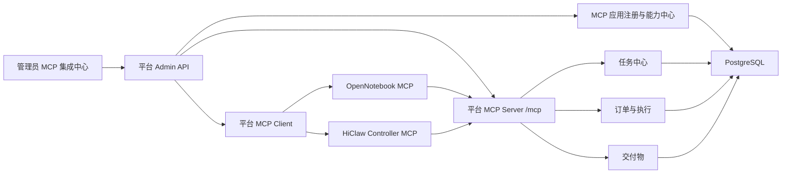
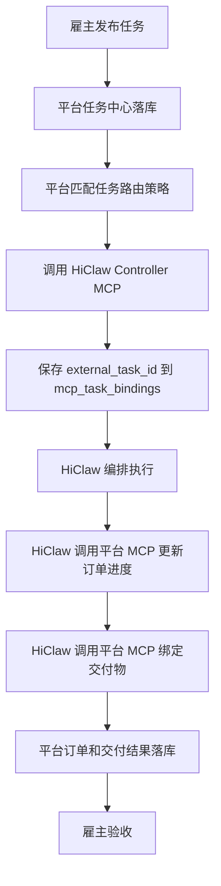
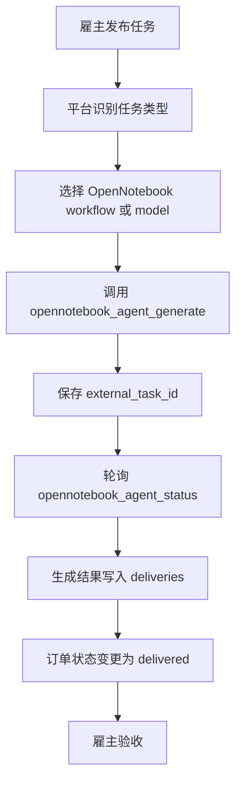

# OpenNotebook 与 HiClaw Controller 双向 MCP 集成实施方案

> 日期：2026-06-20  
> 保存位置：`docs/mcp-external-apps-bidirectional-integration-plan.md`  
> 适用范围：MCP 集成中心、OpenNotebook、HiClaw Controller、后续外部 MCP 应用扩展接入

## 1. 背景与目标

当前平台已经具备 WP5 MCP Server 基础能力，并在管理员视角下规划 MCP 调试台 / MCP 集成中心。下一阶段需要把 OpenNotebook 与 HiClaw Controller 作为外部 MCP 应用接入平台，实现平台与外部应用之间的双向数据互通。

本方案目标：

1. 支持 OpenNotebook 与 HiClaw Controller 通过 MCP 接入平台。
2. 支持后续更多外部应用按同一套机制注册、发现能力、授权、测试、调用、审计和落库。
3. 在管理员管理页面中建设 MCP 集成中心，清晰区分：
   - 平台暴露给外部应用的 MCP 能力。
   - 平台调用外部应用的 MCP 能力。
4. 支持在页面上展示外部应用能力，包括 Tool 列表、Tool schema、业务能力目录、启用状态、最近调用状态和审计记录。
5. 支持管理员在页面上测试 Tool 互通性，验证外部应用是否连通、接口是否可调用、数据是否能正常落库。
6. 支持业务闭环：雇主发布任务后，平台根据任务类型调用 HiClaw Controller 或 OpenNotebook 处理任务，并将外部处理结果回写为平台订单、执行状态和交付结果。

## 2. 集成定位

### 2.1 平台角色

平台同时扮演两个 MCP 角色：

| 角色 | 说明 | 示例 |
| :--- | :--- | :--- |
| MCP Server | 对外暴露平台业务 Tool，供外部应用调用 | HiClaw 调用 `platform.task.list_open`、`platform.order.update_execution` |
| MCP Client | 平台主动调用外部应用暴露的 Tool | 平台调用 OpenNotebook `opennotebook_agent_generate` |

### 2.2 外部应用定位

| 应用 | 集成类型 | 平台调用外部应用 | 外部应用调用平台 |
| :--- | :--- | :--- | :--- |
| OpenNotebook | 双向 MCP 集成 | 内容生成、模型能力查询、任务状态查询、渲染审批 | 回写生成状态、成本、结果和交付物 |
| HiClaw Controller | 双向 MCP 集成 | 任务编排、执行启动、控制器状态查询 | 查询任务、提交报价、更新执行状态、绑定交付物 |
| 后续外部应用 | 配置化双向 MCP 集成 | 按 MCP `tools/list` 与 `tools/call` 动态接入 | 按应用级 Token 和 Tool 白名单访问平台 |

## 3. 总体架构

核心原则：

1. 外部应用按应用维度注册，不为 OpenNotebook 或 HiClaw 写死特殊入口。
2. Tool 能力通过 MCP `tools/list` 发现后保存到数据库。
3. 业务能力可在 Tool 之外额外保存，例如 OpenNotebook workflow、media model、HiClaw execution capability。
4. 平台开放给外部应用的 Tool 必须按应用授权，不能只依赖全局 MCP Token。
5. 所有 inbound 与 outbound 调用都必须写入审计记录。
6. 业务任务与外部任务必须建立绑定关系，便于轮询、回调、重试和最终交付落库。

## 4. MCP 集成中心页面方案

页面入口：

`管理员管理 -> MCP 集成中心`

入口位置建议放在“操作日志”旁边。

### 4.1 一级布局

页面采用左侧应用列表 + 右侧详情面板：

| 区域 | 展示内容 |
| :--- | :--- |
| 左侧应用列表 | OpenNotebook、HiClaw Controller、后续外部 MCP 应用 |
| 右侧详情 | 当前应用的配置、能力、授权、测试、任务绑定和审计 |

应用列表字段：

| 字段 | 说明 |
| :--- | :--- |
| 应用名称 | OpenNotebook / HiClaw Controller |
| 应用编码 | `opennotebook` / `hiclaw-controller` |
| 集成方向 | inbound / outbound / bidirectional |
| Endpoint | 外部 MCP endpoint |
| Transport | streamable-http / http-jsonrpc |
| 启用状态 | enabled / disabled |
| 健康状态 | unknown / healthy / warning / failed |
| 外部 Tool 数 | 从外部应用发现并保存的 Tool 数量 |
| 平台开放 Tool 数 | 授权给该应用调用的平台 Tool 数量 |
| 最近检测时间 | 最近一次连接检测时间 |
| 最近错误 | 最近一次失败摘要 |

### 4.2 详情 Tabs

右侧详情建议包含以下 Tabs：

| Tab | 功能 |
| :--- | :--- |
| 概览 | 应用基础配置、启停、健康状态、入站 Token |
| 外部应用能力 | 展示平台可调用的外部应用 Tool |
| 平台开放能力 | 展示该外部应用可反向调用的平台 Tool |
| 调用测试 | 按两个方向分别测试 Tool 互通性 |
| 业务能力目录 | 展示 workflow、model、controller capability 等业务能力 |
| 任务绑定 | 展示平台任务 / 订单与外部任务 ID 的绑定关系 |
| 调用审计 | 展示 inbound / outbound 调用记录 |

### 4.3 概览 Tab

展示和编辑：

| 字段 | 说明 |
| :--- | :--- |
| 应用名称 | 管理员可编辑 |
| 应用编码 | 创建后不建议修改 |
| Endpoint | 外部 MCP endpoint |
| Transport | MCP 传输方式 |
| 鉴权方式 | none / bearer / api-key / custom-header |
| 鉴权配置 | 密钥只允许写入和轮换，不回显明文 |
| 默认 workspace_id | 外部应用默认工作区 |
| 默认 tenant_id | 租户隔离字段 |
| 启用状态 | 控制平台是否允许该应用参与调用 |
| 入站 MCP Token | 外部应用调用平台 `/mcp` 时使用 |

操作：

1. 保存配置。
2. 测试连接。
3. 发现外部 Tool。
4. 同步业务能力。
5. 启用 / 停用应用。
6. 签发 / 轮换入站 MCP Token。

### 4.4 外部应用能力 Tab

该区域表示“平台 -> 外部应用”。

展示外部应用暴露给平台调用的 Tool：

| 字段 | 说明 |
| :--- | :--- |
| Tool 名称 | 例如 `opennotebook_agent_generate` |
| Tool 描述 | 鼠标悬停时展示完整说明 |
| inputSchema | 支持查看 JSON Schema |
| 是否写操作 | read / write |
| 启用状态 | 管理员可启停 |
| 最近调用状态 | success / failed |
| 最近耗时 | 毫秒 |
| 最近错误 | 错误摘要 |

交互要求：

1. Tool 列表不在顶部额外展示说明，避免页面拥挤。
2. Tool 描述使用稳定 tooltip 或侧边详情面板展示，避免鼠标悬停在两个 Tool 之间时页面高度变化导致卡顿。
3. 选中 Tool 后，在右侧或下方展示 schema、示例参数、最近调用结果。
4. 支持“保存能力快照”，将发现到的 Tool 保存到数据库。

OpenNotebook 初始 Tool：

| Tool | 用途 |
| :--- | :--- |
| `opennotebook_agent_catalog` | 获取 workflow 与 media model 能力目录 |
| `opennotebook_agent_generate` | 创建内容生成任务 |
| `opennotebook_agent_status` | 查询生成任务状态、结果、费用和错误 |
| `opennotebook_framedirector_render_approve` | 批准 FrameDirector 预览继续渲染 |

HiClaw Controller 初始 Tool 建议：

| Tool | 用途 |
| :--- | :--- |
| `hiclaw_task_submit` | 平台向 HiClaw 提交待执行任务 |
| `hiclaw_execution_status` | 查询 HiClaw 外部执行状态 |
| `hiclaw_order_start` | 通知 HiClaw 启动订单执行 |
| `hiclaw_controller_health` | 查询 Controller 健康状态 |

### 4.5 平台开放能力 Tab

该区域表示“外部应用 -> 平台”。

展示平台授权给当前外部应用调用的 Tool：

| 字段 | 说明 |
| :--- | :--- |
| 平台 Tool 名称 | 例如 `platform.task.list_open` |
| 描述 | 平台 Tool 功能说明 |
| inputSchema | 入参 JSON Schema |
| 是否写操作 | 写操作必须支持幂等 |
| 是否授权 | 当前应用是否可调用 |
| 限流配置 | 每分钟最大调用次数 |
| 最近调用状态 | success / failed |
| 调用次数 | 当前应用调用该 Tool 的累计次数 |

平台开放 Tool：

| Tool | 用途 |
| :--- | :--- |
| `platform.agent.search` | 搜索平台 Agent |
| `platform.agent.get` | 获取 Agent 详情 |
| `platform.agent.report_health` | 上报 Agent 健康状态 |
| `platform.task.get` | 获取任务详情 |
| `platform.task.list_open` | 查询开放任务 |
| `platform.order.create` | 创建订单 |
| `platform.order.get` | 获取订单详情 |
| `platform.order.update_execution` | 更新订单执行进度 |
| `platform.artifact.attach` | 绑定交付物 |
| `platform.quote.submit` | 提交报价 |

安全要求：

1. 每个外部应用使用独立入站 Token。
2. Token 只展示一次，数据库只保存 hash。
3. Tool 必须按应用授权。
4. 写操作必须校验 `idempotency_key`。
5. 调用必须写审计，审计 caller 建议使用 `mcp-app:<app_code>`。
6. 支持按应用和 Tool 配置限流。

### 4.6 调用测试 Tab

调用测试必须分成两个明确区域。

#### 4.6.1 平台调用外部应用

文案建议：`平台 -> 外部应用`

用途：

1. 测试外部应用是否连通。
2. 测试外部 Tool 是否可调用。
3. 验证外部返回是否符合 MCP 结果格式。
4. 验证调用记录是否落库。

流程：

1. 选择应用。
2. 选择外部 Tool。
3. 根据 schema 生成示例参数。
4. 管理员编辑 JSON 参数。
5. 执行 `tools/call`。
6. 展示请求、响应、耗时、HTTP 状态、MCP 状态、错误信息。
7. 写入调用审计。

#### 4.6.2 外部应用调用平台模拟

文案建议：`外部应用 -> 平台`

用途：

1. 模拟当前应用身份调用平台 Tool。
2. 验证 Token、Tool 白名单、限流、幂等和审计是否生效。
3. 验证平台 Tool 结果是否可被外部应用消费。

流程：

1. 选择应用。
2. 选择已授权的平台 Tool。
3. 根据 schema 生成示例参数。
4. 使用当前应用身份模拟调用。
5. 展示平台 MCP 返回。
6. 写入调用审计。

### 4.7 业务能力目录 Tab

外部 Tool 是协议能力，业务能力目录是平台业务使用时的可选能力。

OpenNotebook 业务能力：

| 类型 | 示例 |
| :--- | :--- |
| workflow | mindmap、flashcard、podcast、invoice、digihuman、videoagent |
| media model | midjourney、gpt-image-2、kling-v1、suno-v3、framedirector-v1 |

HiClaw Controller 业务能力：

| 类型 | 示例 |
| :--- | :--- |
| orchestration | 任务拆解、执行编排、Agent 调度 |
| execution | 外部任务执行、进度回传、失败重试 |
| delivery | 交付物聚合、结果回传 |

展示字段：

| 字段 | 说明 |
| :--- | :--- |
| 能力类型 | workflow / model / orchestration / execution |
| 能力编码 | 外部应用返回的 code |
| 展示名称 | 管理员可读名称 |
| 描述 | 能力说明 |
| 参数定义 | JSON Schema 或原始参数 |
| 启用状态 | 是否参与业务路由 |
| 适用任务类型 | 任务分类映射 |

### 4.8 任务绑定 Tab

任务绑定用于串联平台任务、订单和外部任务。

展示字段：

| 字段 | 说明 |
| :--- | :--- |
| 平台 task_id | 平台任务 ID |
| 平台 order_id | 平台订单 ID |
| 外部应用 | OpenNotebook / HiClaw Controller |
| external_task_id | 外部任务 ID |
| submit_tool | 提交任务使用的 Tool |
| status_tool | 查询状态使用的 Tool |
| 外部状态 | submitted / running / completed / failed |
| 平台状态 | 对应平台任务或订单状态 |
| 最近同步时间 | 最近轮询或回调时间 |
| 最后错误 | 最近失败摘要 |

操作：

1. 手动提交外部任务。
2. 手动轮询状态。
3. 查看请求和响应。
4. 重试失败调用。
5. 查看生成的交付物。

### 4.9 调用审计 Tab

展示所有 MCP 调用：

| 字段 | 说明 |
| :--- | :--- |
| 时间 | 调用时间 |
| 应用 | 外部应用 |
| 方向 | inbound / outbound |
| Tool | 调用的 Tool |
| 状态 | success / failed |
| 耗时 | 毫秒 |
| caller | `platform` 或 `mcp-app:<app_code>` |
| request_id | 请求追踪 ID |
| error | 错误摘要 |

支持筛选：

1. 应用。
2. 方向。
3. Tool。
4. 状态。
5. 时间范围。

## 5. 数据模型方案

### 5.1 mcp_app_integrations

保存外部 MCP 应用基础信息。

| 字段 | 说明 |
| :--- | :--- |
| id | 主键 |
| name | 应用名称 |
| code | 应用编码，唯一 |
| direction | inbound / outbound / bidirectional |
| transport | streamable-http / http-jsonrpc |
| endpoint | 外部 MCP endpoint |
| auth_mode | none / bearer / api-key / custom-header |
| auth_config | 外部应用调用鉴权配置，敏感字段加密或脱敏 |
| mcp_token_hash | 外部应用调用平台 `/mcp` 的 Token hash |
| mcp_token_issued_at | Token 签发时间 |
| enabled | 是否启用 |
| health_status | 健康状态 |
| last_checked_at | 最近检测时间 |
| last_error | 最近错误 |
| default_workspace_id | 默认工作区 |
| default_tenant_id | 默认租户 |

### 5.2 mcp_app_tools

保存外部应用暴露给平台调用的 Tool。

| 字段 | 说明 |
| :--- | :--- |
| id | 主键 |
| app_id | 应用 ID |
| name | Tool 名称 |
| description | Tool 描述 |
| input_schema | 入参 schema |
| output_schema | 出参 schema，可选 |
| is_write | 是否写操作 |
| enabled | 是否启用 |
| raw_tool | 原始 MCP Tool 定义 |
| last_called_at | 最近调用时间 |
| last_status | 最近调用状态 |
| last_error | 最近错误 |

### 5.3 mcp_app_tool_permissions

保存某个外部应用可调用哪些平台 Tool。

| 字段 | 说明 |
| :--- | :--- |
| id | 主键 |
| app_id | 应用 ID |
| tool_name | 平台 Tool 名称 |
| enabled | 是否授权 |
| rate_limit_per_minute | 每分钟限流 |
| require_idempotency | 是否强制幂等 |

### 5.4 mcp_app_capabilities

保存业务能力目录。

| 字段 | 说明 |
| :--- | :--- |
| id | 主键 |
| app_id | 应用 ID |
| capability_type | workflow / model / orchestration / execution |
| capability_code | 能力编码 |
| display_name | 展示名称 |
| description | 描述 |
| input_schema | 参数定义 |
| enabled | 是否启用 |
| raw_payload | 原始能力数据 |

### 5.5 mcp_app_invocations

保存平台与外部应用之间的调用审计。

| 字段 | 说明 |
| :--- | :--- |
| id | 主键 |
| app_id | 应用 ID |
| direction | inbound / outbound |
| tool_name | Tool 名称 |
| request_id | 请求 ID |
| request_payload | 请求摘要 |
| response_payload | 响应摘要 |
| status | success / failed |
| duration_ms | 耗时 |
| error_message | 错误 |
| created_at | 创建时间 |

### 5.6 mcp_task_bindings

保存平台任务 / 订单与外部任务的绑定关系。

| 字段 | 说明 |
| :--- | :--- |
| id | 主键 |
| app_id | 应用 ID |
| task_id | 平台任务 ID |
| order_id | 平台订单 ID |
| external_task_id | 外部任务 ID |
| submit_tool_name | 提交任务使用的 Tool |
| status_tool_name | 查询状态使用的 Tool |
| status | 当前绑定状态 |
| last_sync_at | 最近同步时间 |
| last_payload | 最近外部响应 |
| last_error | 最近错误 |

## 6. 后端 API 方案

管理端 API 建议统一放在：

`/api/v1/admin/mcp-integrations`

### 6.1 应用管理

| Method | Path | 用途 |
| :--- | :--- | :--- |
| GET | `/apps` | 应用列表 |
| POST | `/apps` | 新增应用 |
| PATCH | `/apps/:id` | 更新应用配置 |
| POST | `/apps/:id/enable` | 启用应用 |
| POST | `/apps/:id/disable` | 停用应用 |
| POST | `/apps/:id/inbound-token` | 签发或轮换入站 Token |

### 6.2 外部能力

| Method | Path | 用途 |
| :--- | :--- | :--- |
| POST | `/apps/:id/discover-tools` | 调用外部 `tools/list` 并保存 Tool |
| GET | `/apps/:id/tools` | 查询已保存外部 Tool |
| PATCH | `/apps/:id/tools/:toolName` | 启停外部 Tool |
| POST | `/apps/:id/sync-capabilities` | 同步业务能力目录 |
| GET | `/apps/:id/capabilities` | 查询业务能力目录 |

### 6.3 平台开放能力

| Method | Path | 用途 |
| :--- | :--- | :--- |
| GET | `/apps/:id/platform-tools` | 查询平台 Tool 授权列表 |
| PATCH | `/apps/:id/platform-tools/:toolName` | 更新授权、限流、幂等策略 |

### 6.4 调用测试

| Method | Path | 用途 |
| :--- | :--- | :--- |
| POST | `/apps/:id/test-external-tool` | 平台调用外部 Tool |
| POST | `/apps/:id/test-platform-tool` | 模拟外部应用调用平台 Tool |

### 6.5 任务绑定

| Method | Path | 用途 |
| :--- | :--- | :--- |
| POST | `/apps/:id/task-bindings/submit` | 提交平台任务到外部应用 |
| GET | `/task-bindings` | 查询任务绑定列表 |
| POST | `/task-bindings/:id/poll` | 手动轮询外部任务状态 |

### 6.6 调用审计

| Method | Path | 用途 |
| :--- | :--- | :--- |
| GET | `/invocations` | 查询 inbound / outbound 调用记录 |

## 7. 业务数据流转方案

### 7.1 雇主任务进入 HiClaw Controller

适用于需要编排、多 Agent 调度、复杂执行链路的任务。

关键落库点：

1. `tasks`：雇主任务。
2. `orders`：订单与执行状态。
3. `mcp_task_bindings`：平台任务与外部任务绑定。
4. `mcp_app_invocations`：平台和 HiClaw 调用审计。
5. `deliveries`：最终交付物。

### 7.2 雇主任务直接进入 OpenNotebook

适用于平台能明确识别为内容生成、图片、视频、音频、文档等可直接映射到 OpenNotebook workflow 或 model 的任务。

关键映射：

| 平台数据 | OpenNotebook 参数 |
| :--- | :--- |
| `task.title` | title / name |
| `task.description` | prompt / sourceMaterial |
| `task.attachments` | input files / references |
| `task.budget` | cost limit |
| `task.deadline` | deadline |
| `capability_code` | workflow / model |

### 7.3 外部应用反向回写平台

外部应用使用独立入站 MCP Token 调用平台 `/mcp`。

常见回写：

| 场景 | 平台 Tool |
| :--- | :--- |
| 查询开放任务 | `platform.task.list_open` |
| 查询任务详情 | `platform.task.get` |
| 提交报价 | `platform.quote.submit` |
| 创建订单 | `platform.order.create` |
| 更新执行状态 | `platform.order.update_execution` |
| 绑定交付物 | `platform.artifact.attach` |
| 查询订单 | `platform.order.get` |

## 8. 扩展性设计

为了支持后续更多外部应用接入，必须避免只为 OpenNotebook 和 HiClaw 写死逻辑。

### 8.1 应用扩展

新增应用只需要配置：

1. 应用名称和编码。
2. Endpoint。
3. Transport。
4. 鉴权方式。
5. 入站 Token。
6. Tool 授权策略。
7. 可选能力同步规则。
8. 可选任务路由规则。

### 8.2 能力扩展

Tool 能力通过 MCP `tools/list` 自动发现。业务能力通过标准能力目录保存：

1. `workflow`。
2. `model`。
3. `orchestration`。
4. `execution`。
5. `connector`。
6. 后续自定义类型。

### 8.3 路由扩展

任务路由策略建议配置化：

| 策略字段 | 示例 |
| :--- | :--- |
| task_type | video_generation |
| app_code | opennotebook |
| capability_code | videoagent |
| submit_tool | opennotebook_agent_generate |
| status_tool | opennotebook_agent_status |
| priority | 100 |
| enabled | true |

后续可以扩展为按任务类型、预算、交付格式、模型偏好、健康状态和成本路由。

## 9. 安全与稳定性

必须实现：

1. 应用级入站 Token，不同外部应用独立签发。
2. Token hash 存储，不落明文。
3. 平台 Tool 按应用白名单授权。
4. 写操作强制幂等。
5. 按应用和 Tool 限流。
6. outbound 调用配置超时。
7. 支持失败重试和错误记录。
8. 禁止未启用应用参与调用。
9. 调用审计可追踪 caller、request_id、tool、耗时和错误。
10. 外部 endpoint 建议做 allowlist 或管理员审核，降低 SSRF 风险。

## 10. 分阶段实施计划

### 阶段一：数据模型与默认应用

目标：

1. 新增 MCP 集成中心数据表。
2. 初始化默认应用 OpenNotebook 和 HiClaw Controller。
3. 支持应用配置、启停、健康状态和入站 Token。

交付物：

1. `mcp_app_integrations`。
2. `mcp_app_tools`。
3. `mcp_app_tool_permissions`。
4. `mcp_app_capabilities`。
5. `mcp_app_invocations`。
6. `mcp_task_bindings`。

### 阶段二：管理端 MCP 集成中心页面

目标：

1. 管理员管理页面新增 MCP 集成中心入口。
2. 完成应用列表、概览、外部能力、平台开放能力、调用测试、业务能力、任务绑定、调用审计页面。
3. 页面清晰区分“平台 -> 外部应用”和“外部应用 -> 平台”。

### 阶段三：平台调用外部应用

目标：

1. 实现通用 MCP Client。
2. 支持 `tools/list`。
3. 支持 `tools/call`。
4. 保存外部 Tool。
5. 支持 OpenNotebook 连接测试和 Tool 调用测试。

### 阶段四：外部应用调用平台

目标：

1. `/mcp` 支持应用级 Token。
2. `tools/list` 只返回当前应用已授权 Tool。
3. `tools/call` 校验应用 Tool 白名单。
4. 实现限流、幂等和审计。
5. 页面支持模拟外部应用调用平台 Tool。

### 阶段五：业务任务流转

目标：

1. 支持平台任务提交到外部应用。
2. 保存 external_task_id。
3. 支持轮询外部任务状态。
4. 支持外部完成后生成平台交付物。
5. 支持订单状态更新到 delivered。

### 阶段六：OpenNotebook 与 HiClaw 能力适配

目标：

1. OpenNotebook 同步 workflow 和 media model。
2. HiClaw Controller 同步编排和执行能力。
3. 建立任务类型到外部能力的映射关系。
4. 支持管理员启停能力。

### 阶段七：运营化增强

目标：

1. 定时健康检查。
2. 定时轮询外部任务状态。
3. 失败重试。
4. 熔断策略。
5. 调用统计。
6. 告警。
7. 审计筛选和导出。

## 11. 测试验证方案

### 11.1 后端验证

1. 应用默认初始化成功。
2. OpenNotebook endpoint 配置保存成功。
3. `tools/list` 能发现并保存 Tool。
4. 外部 Tool 调用成功时写入 outbound 审计。
5. 外部 Tool 返回 `result.isError = true` 时判定为失败。
6. 应用级 Token 可访问 `/mcp`。
7. 未授权平台 Tool 被拒绝。
8. 已授权平台 Tool 可调用并写入 caller。
9. 限流生效。
10. 任务提交后保存 `external_task_id`。
11. 任务完成后写入交付物。
12. 订单状态正确流转。

### 11.2 前端验证

1. 管理员可以看到 MCP 集成中心入口。
2. 应用列表加载正常。
3. 概览配置可保存。
4. 外部 Tool 列表展示正常。
5. Tool 描述 tooltip 不造成列表卡顿。
6. 平台开放 Tool 授权可切换。
7. 双向调用测试结果展示清晰。
8. 业务能力目录展示正常。
9. 任务绑定可查询和轮询。
10. 调用审计可筛选和查看详情。

### 11.3 端到端验证

1. 管理员配置 OpenNotebook。
2. 发现 OpenNotebook Tool 并保存。
3. 同步 OpenNotebook workflow / model。
4. 管理员执行 `opennotebook_agent_catalog` 测试。
5. 管理员模拟平台任务提交到 OpenNotebook。
6. 平台保存外部任务绑定。
7. 平台轮询外部任务完成。
8. 平台生成交付物并更新订单状态。
9. HiClaw Controller 使用应用级 Token 调用平台 `/mcp`。
10. HiClaw 只能看到被授权的平台 Tool。
11. HiClaw 调用未授权 Tool 被拒绝。
12. 所有调用在审计中可追踪。

## 12. 验收标准

本方案验收标准：

1. 管理员管理页面存在 MCP 集成中心入口，入口位于操作日志旁边。
2. 页面中 OpenNotebook 与 HiClaw Controller 作为默认外部应用展示。
3. OpenNotebook 可配置 endpoint，并可通过 MCP 发现 Tool。
4. 外部 Tool 可保存到数据库并在页面展示。
5. 页面可展示 OpenNotebook workflow 和 media model 等业务能力。
6. 页面可展示平台开放给每个外部应用的 Tool 白名单。
7. 应用级入站 Token 可签发、轮换，且不回显历史明文。
8. 外部应用使用应用级 Token 调用 `/mcp` 时，只能看到已授权 Tool。
9. 未授权 Tool 调用被拒绝并写入失败审计。
10. 已授权 Tool 调用成功并写入 caller 为 `mcp-app:<app_code>` 的审计。
11. 管理员可在页面分别测试“平台 -> 外部应用”和“外部应用 -> 平台”。
12. 平台提交外部任务后，`mcp_task_bindings` 保存 external_task_id。
13. 外部任务完成后，平台可生成交付物并更新订单状态。
14. OpenNotebook 与 HiClaw Controller 的接入逻辑具备扩展性，新增外部 MCP 应用不需要新增独立页面。
15. 后端构建通过。
16. 前端构建通过。
17. MCP 集成中心验收脚本通过。
18. WP5 原 MCP Server 回归测试通过。

## 13. 风险与待确认事项

| 风险 | 影响 | 建议 |
| :--- | :--- | :--- |
| HiClaw Controller endpoint 尚未固定 | 无法真实联调 HiClaw outbound Tool | 先使用 mock MCP server 验证协议与数据流 |
| 外部应用返回 schema 不稳定 | 页面表单和测试参数生成可能异常 | 保存 raw schema，并对常用 Tool 配置示例参数 |
| 外部任务耗时长 | 同步请求可能超时 | 使用任务绑定 + 轮询 / 回调模式 |
| Token 泄露 | 外部应用可调用平台 Tool | 支持轮换、限流、最小权限和审计 |
| Tool 权限过宽 | 外部应用越权访问平台数据 | 默认禁用，管理员显式授权 |
| 业务路由误判 | 任务被发到错误外部应用 | 初期由管理员配置映射，后续再自动推荐 |

## 14. 推荐落地顺序

建议按以下顺序落地：

1. 数据表与默认应用初始化。
2. 管理端 MCP 集成中心页面骨架。
3. OpenNotebook 连接、发现 Tool、保存 Tool、同步能力。
4. 平台开放 Tool 白名单与应用级 Token。
5. 双向调用测试。
6. 任务绑定与外部任务提交。
7. 外部状态轮询与交付物落库。
8. HiClaw Controller endpoint 接入和真实联调。
9. 运营化增强：健康检查、重试、限流、告警、统计。

