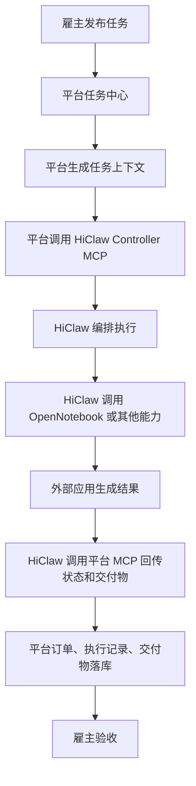
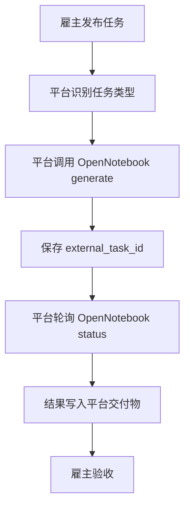
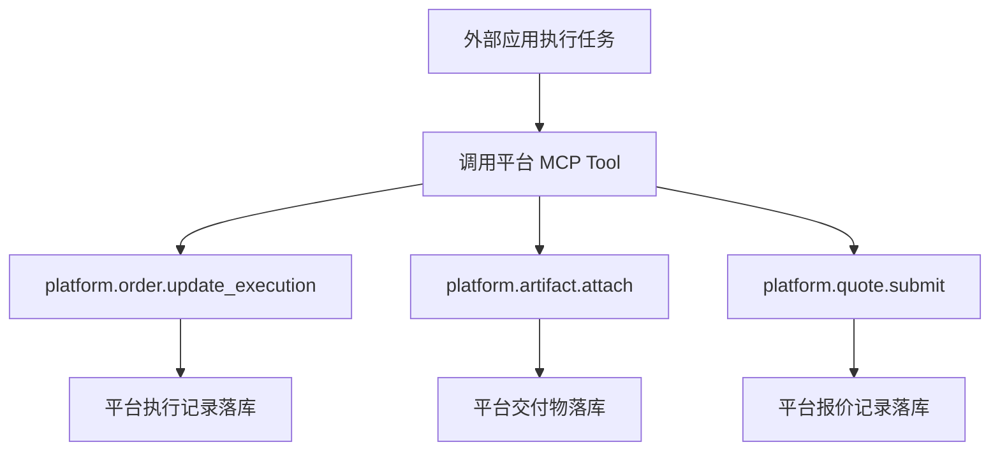

# MCP 集成中心双向应用接入实施方案

日期：2026-06-20

## 1. 背景与目标

当前平台已经具备 WP5 MCP Server 基础能力，并已在管理员视角下新增 MCP 调试台。现阶段需要进一步把 MCP 调试台升级为面向业务集成的 MCP 集成中心，用于统一接入 OpenNotebook、HiClaw Controller 以及后续更多外部 MCP 应用。

本方案的核心目标是：

1. 支持多个外部 MCP 应用统一注册、配置、发现、授权、调用和审计。
2. OpenNotebook 和 HiClaw Controller 都按双向 MCP 集成应用处理。
3. 页面展示每个外部应用的能力，包括外部 Tool 列表、平台开放 Tool 列表、业务能力目录和调用记录。
4. 支持管理员在页面上保存应用能力，并对 Tool 做互通性调用测试。
5. 支持雇主发布任务后，平台通过 MCP 调用外部应用处理任务，并将状态、进度、费用、结果和交付物回写平台。
6. 支持外部应用反向调用平台 MCP Tool，上报报价、执行进度、订单状态和交付结果。

## 2. 当前基础

### 2.1 平台已有 MCP Server 能力

平台当前已暴露 MCP Server，外部应用可以通过 `POST /mcp` 调用平台 Tool。

当前平台 Tool 包括：

| Tool | 类型 | 用途 |
| :--- | :--- | :--- |
| `platform.agent.search` | 读 | 搜索平台 Agent |
| `platform.agent.get` | 读 | 获取 Agent 详情 |
| `platform.agent.report_health` | 写 | 上报 Agent 健康状态 |
| `platform.task.get` | 读 | 获取任务详情 |
| `platform.task.list_open` | 读 | 查询开放任务 |
| `platform.order.create` | 写 | 创建订单 |
| `platform.order.get` | 读 | 获取订单详情 |
| `platform.order.update_execution` | 写 | 更新订单执行进度 |
| `platform.artifact.attach` | 写 | 绑定交付物 |
| `platform.quote.submit` | 写 | 提交报价 |

### 2.2 当前 MCP 调试台能力

管理员页面当前已经有 MCP 调试台入口，并已区分：

- 平台 MCP 服务：调试外部应用调用当前平台。
- 外部 MCP 应用：调试当前平台调用外部应用。

当前外部调用测试已经验证 OpenNotebook MCP 服务：

- Endpoint：`https://api.opennotebook.chat/api/v1/agent/mcp/`
- Transport：`streamable-http`
- `tools/list` 可发现 4 个 Tool。
- `opennotebook_agent_catalog` 可返回 Agent workflow 和 media model。
- `result.isError = true` 的远端错误已纳入失败判断。

## 3. 总体定位

MCP 集成中心不是单个调试页面，而是平台的 MCP 应用接入管理中心。

它需要支持三类能力：

| 能力 | 说明 | 示例 |
| :--- | :--- | :--- |
| 应用注册 | 注册 OpenNotebook、HiClaw Controller 等外部 MCP 应用 | 应用名称、endpoint、transport、鉴权 |
| 能力发现 | 发现并保存外部应用暴露的 Tool 和业务能力 | OpenNotebook 的 4 个 MCP Tool、agents/models |
| 双向互通 | 平台调用外部应用，外部应用调用平台 | 平台发起生成任务，外部应用回传交付物 |

OpenNotebook 和 HiClaw Controller 都应作为双向 MCP 集成应用：

| 应用 | 定位 | 平台调用外部 | 外部调用平台 |
| :--- | :--- | :--- | :--- |
| OpenNotebook | 内容生成与媒体生成能力提供方 | 生成任务、查询状态、批准渲染 | 回传任务状态、结果、费用、交付物 |
| HiClaw Controller | 执行编排与任务控制器 | 提交任务、启动执行、查询控制器状态 | 提交报价、更新订单执行、绑定交付结果 |

## 4. 业务主流程

### 4.1 HiClaw 编排型流程

适用于需要外部控制器编排、拆分、派发或多工具协作的任务。



### 4.2 OpenNotebook 直接执行流程

适用于平台可明确识别任务类型，并可直接映射到 OpenNotebook workflow 或 model 的任务。



### 4.3 外部应用反向回调平台

外部应用可通过平台 MCP Server 回传数据：



## 5. 页面设计

页面名称建议改为：

`管理员管理 -> MCP 集成中心`

入口仍放在管理员管理页面中，与操作日志并列。

### 5.1 页面一级结构

MCP 集成中心包含：

1. 应用列表
2. 应用详情
3. 外部能力
4. 平台开放能力
5. 调用测试
6. 数据映射
7. 调用审计

### 5.2 应用列表

应用列表展示所有接入的 MCP 应用。

| 字段 | 说明 |
| :--- | :--- |
| 应用名称 | OpenNotebook、HiClaw Controller |
| 应用编码 | `opennotebook`、`hiclaw-controller` |
| 集成方向 | `bidirectional` |
| Transport | `streamable-http`、`http-jsonrpc` |
| Endpoint | 外部 MCP endpoint |
| 启用状态 | enabled / disabled |
| 健康状态 | healthy / warning / failed / unknown |
| 外部 Tool 数量 | 从外部应用发现并保存的 Tool 数量 |
| 平台 Tool 数量 | 平台授权给该应用调用的 Tool 数量 |
| 最近检测 | 最近一次连接检测时间 |
| 最近错误 | 最近一次错误摘要 |

默认预置两个应用：

| 应用 | 默认配置 |
| :--- | :--- |
| OpenNotebook | `https://api.opennotebook.chat/api/v1/agent/mcp/` |
| HiClaw Controller | endpoint 待配置，平台侧入站应用默认启用 |

### 5.3 应用详情页

应用详情页分为以下 Tabs：

1. 概览
2. 外部能力
3. 平台开放能力
4. 调用测试
5. 数据映射
6. 调用审计

### 5.4 概览

概览展示应用基础配置：

- 应用名称
- 应用编码
- 集成方向
- Endpoint
- Transport
- 鉴权方式
- 默认 `workspace_id`
- 默认 `tenant_id`
- 启用状态
- 健康状态
- 最近 `tools/list` 时间
- 最近 catalog 同步时间
- 最近错误信息

支持操作：

- 保存配置
- 测试连接
- 发现 Tool
- 同步业务能力
- 启用或停用应用

### 5.5 外部能力

外部能力用于展示外部应用自身暴露的 Tool。

OpenNotebook 已知 Tool：

| Tool | 类型 | 用途 |
| :--- | :--- | :--- |
| `opennotebook_agent_catalog` | 读 | 获取 Agent workflow 和 media model |
| `opennotebook_agent_generate` | 写 | 创建 Agent 生成任务 |
| `opennotebook_agent_status` | 读 | 查询任务状态、结果、费用和错误 |
| `opennotebook_framedirector_render_approve` | 写 | 批准 FrameDirector 预览继续渲染 |

HiClaw Controller Tool 需要通过其 MCP endpoint 动态发现。若初期暂无外部 endpoint，可先只展示平台开放给 HiClaw 的入站 Tool 权限。

外部 Tool 列表字段：

- Tool 名称
- 描述
- inputSchema
- 读写类型
- 是否启用
- 最近调用状态
- 最近调用耗时
- 最近错误

### 5.6 业务能力目录

外部 Tool 之外，还要保存外部应用的业务能力。

OpenNotebook `opennotebook_agent_catalog` 返回的业务能力需要保存并展示：

- Agent workflow：mindmap、flashcard、podcast、invoice、digihuman、videoagent
- Media model：midjourney、gpt-image-2、kling-v1、suno-v3、framedirector-v1

页面展示字段：

- 能力类型：workflow / model
- 能力编码
- 展示名称
- 描述
- 参数定义
- 是否启用
- 适用任务类型

### 5.7 平台开放能力

平台开放能力用于配置某个外部应用可以反向调用哪些平台 Tool。

页面需要展示：

- 平台 Tool 名称
- 描述
- inputSchema
- 读写类型
- 是否需要 `idempotency_key`
- 是否授权给当前应用
- 调用次数
- 最近调用状态

支持操作：

- 启用或禁用某个 Tool 权限
- 查看 Tool Schema
- 复制示例参数
- 模拟该应用身份调用平台 Tool

### 5.8 调用测试

调用测试需要明确区分两个方向：

| 方向 | 页面文案 | 调用内容 |
| :--- | :--- | :--- |
| 平台调用外部 | `平台 -> 外部应用` | 调用外部应用 `tools/list`、`tools/call` |
| 外部调用平台模拟 | `外部应用 -> 平台` | 模拟应用身份调用平台 Tool |

平台调用外部应用测试：

1. 选择应用。
2. 选择外部 Tool。
3. 自动生成示例参数。
4. 编辑 JSON 参数。
5. 执行 `tools/call`。
6. 展示请求、响应、HTTP 状态、MCP 状态、耗时和错误。
7. 调用记录落库。

外部调用平台模拟：

1. 选择应用。
2. 选择授权给该应用的平台 Tool。
3. 自动生成示例参数。
4. 使用该应用的 token/caller 模拟调用。
5. 验证平台 Tool 返回、幂等保护、审计落库。

### 5.9 数据映射

数据映射用于配置平台业务对象如何转换为外部 Tool 参数，以及外部结果如何回写平台。

OpenNotebook 映射示例：

| 平台场景 | 外部 Tool | 映射规则 |
| :--- | :--- | :--- |
| 思维导图任务 | `opennotebook_agent_generate` | `task.description -> params.sourceMaterial` |
| 图片生成任务 | `opennotebook_agent_generate` | `task.description -> prompt`，`model -> gpt-image-2` |
| 视频生成任务 | `opennotebook_agent_generate` | `task.description -> prompt`，`model -> kling-v1` |
| 状态同步 | `opennotebook_agent_status` | `external_task_id -> task_id` |
| 交付回写 | 平台交付逻辑 | `result_url -> artifact.url`，`result_data -> artifact.metadata` |

HiClaw Controller 映射示例：

| 平台场景 | 外部 Tool | 映射规则 |
| :--- | :--- | :--- |
| 任务发布 | `hiclaw_task_submit` | 任务完整上下文 |
| 订单确认 | `hiclaw_order_start` | `order_id`、`task_id`、`agent_id` |
| 执行查询 | `hiclaw_execution_status` | `external_task_id` |
| 执行回传 | `platform.order.update_execution` | 进度、阶段、消息 |
| 交付回传 | `platform.artifact.attach` | 交付 URL、摘要、结构化结果 |

第一阶段数据映射可以只读展示和 JSON 配置，后续再做可视化编辑。

### 5.10 调用审计

调用审计展示所有 inbound/outbound MCP 调用。

| 字段 | 说明 |
| :--- | :--- |
| 时间 | 调用时间 |
| 应用 | OpenNotebook、HiClaw Controller |
| 方向 | inbound / outbound |
| Tool | 调用的 Tool |
| 状态 | success / failed |
| HTTP 状态 | 外部调用时记录 |
| 耗时 | durationMs |
| 平台任务 | platform_task_id |
| 平台订单 | platform_order_id |
| 外部任务 | external_task_id |
| 错误 | errorMessage |

详情弹窗展示：

- request_json
- response_json
- input_json
- output_json
- status_code
- content_type
- duration_ms
- caller
- idempotency_key
- error_message

## 6. 数据模型设计

### 6.1 `mcp_app_integrations`

保存 MCP 应用配置。

| 字段 | 类型 | 说明 |
| :--- | :--- | :--- |
| `id` | uuid | 主键 |
| `code` | varchar | 应用编码 |
| `name` | varchar | 应用名称 |
| `description` | text | 应用说明 |
| `direction` | enum | inbound / outbound / bidirectional |
| `transport` | enum | streamable-http / http-jsonrpc |
| `endpoint_url` | varchar | 外部 MCP endpoint |
| `auth_mode` | enum | none / bearer / headers |
| `auth_config_encrypted` | text | 加密后的鉴权配置 |
| `default_workspace_id` | varchar | 默认 workspace_id |
| `default_tenant_id` | varchar | 默认 tenant_id |
| `enabled` | boolean | 是否启用 |
| `health_status` | enum | healthy / warning / failed / unknown |
| `last_checked_at` | timestamp | 最近检测时间 |
| `last_discovered_at` | timestamp | 最近 Tool 发现时间 |
| `last_synced_at` | timestamp | 最近业务能力同步时间 |
| `last_error` | text | 最近错误 |
| `created_at` | timestamp | 创建时间 |
| `updated_at` | timestamp | 更新时间 |

### 6.2 `mcp_app_tools`

保存外部发现的 Tool 和平台开放给应用的 Tool。

| 字段 | 类型 | 说明 |
| :--- | :--- | :--- |
| `id` | uuid | 主键 |
| `app_id` | uuid | 应用 ID |
| `direction` | enum | external / platform |
| `name` | varchar | Tool 名称 |
| `description` | text | Tool 描述 |
| `input_schema` | jsonb | 输入 Schema |
| `is_write` | boolean | 是否写操作 |
| `requires_idempotency` | boolean | 是否需要幂等键 |
| `enabled` | boolean | 是否启用 |
| `last_seen_at` | timestamp | 最近发现时间 |
| `last_called_at` | timestamp | 最近调用时间 |
| `last_status` | varchar | 最近调用状态 |
| `last_error` | text | 最近错误 |

### 6.3 `mcp_app_capabilities`

保存外部应用的业务能力目录。

| 字段 | 类型 | 说明 |
| :--- | :--- | :--- |
| `id` | uuid | 主键 |
| `app_id` | uuid | 应用 ID |
| `capability_type` | enum | workflow / model / skill |
| `code` | varchar | 能力编码 |
| `name` | varchar | 展示名称 |
| `description` | text | 描述 |
| `schema_json` | jsonb | 参数定义 |
| `raw_json` | jsonb | 原始响应 |
| `enabled` | boolean | 是否启用 |
| `last_synced_at` | timestamp | 最近同步时间 |

### 6.4 `mcp_app_tool_permissions`

保存某个应用可调用的平台 Tool 白名单。

| 字段 | 类型 | 说明 |
| :--- | :--- | :--- |
| `id` | uuid | 主键 |
| `app_id` | uuid | 应用 ID |
| `tool_name` | varchar | 平台 Tool 名称 |
| `enabled` | boolean | 是否授权 |
| `rate_limit_per_minute` | integer | 限流配置 |
| `created_at` | timestamp | 创建时间 |
| `updated_at` | timestamp | 更新时间 |

### 6.5 `mcp_app_invocations`

保存所有 MCP 调用审计。

| 字段 | 类型 | 说明 |
| :--- | :--- | :--- |
| `id` | uuid | 主键 |
| `app_id` | uuid | 应用 ID |
| `direction` | enum | inbound / outbound |
| `tool_name` | varchar | Tool 名称 |
| `request_json` | jsonb | 请求 JSON |
| `response_json` | jsonb | 响应 JSON |
| `status` | enum | success / failed |
| `http_status` | integer | HTTP 状态 |
| `content_type` | varchar | 响应类型 |
| `duration_ms` | integer | 耗时 |
| `error_message` | text | 错误信息 |
| `idempotency_key` | varchar | 幂等键 |
| `platform_task_id` | uuid | 平台任务 ID |
| `platform_order_id` | uuid | 平台订单 ID |
| `external_task_id` | varchar | 外部任务 ID |
| `created_at` | timestamp | 创建时间 |

### 6.6 `mcp_task_bindings`

保存平台任务/订单与外部任务之间的绑定。

| 字段 | 类型 | 说明 |
| :--- | :--- | :--- |
| `id` | uuid | 主键 |
| `app_id` | uuid | 应用 ID |
| `platform_task_id` | uuid | 平台任务 ID |
| `platform_order_id` | uuid | 平台订单 ID |
| `external_task_id` | varchar | 外部任务 ID |
| `external_tool_name` | varchar | 创建外部任务的 Tool |
| `status` | varchar | 外部任务状态 |
| `progress` | varchar | 外部进度 |
| `result_url` | text | 结果 URL |
| `result_json` | jsonb | 结构化结果 |
| `cost` | numeric | 外部费用 |
| `error_message` | text | 错误 |
| `last_polled_at` | timestamp | 最近轮询时间 |
| `created_at` | timestamp | 创建时间 |
| `updated_at` | timestamp | 更新时间 |

## 7. 后端模块设计

建议新增模块：

`backend/src/mcp-integrations`

模块结构：

```text
mcp-integrations/
  mcp-integrations.module.ts
  entities/
    mcp-app-integration.entity.ts
    mcp-app-tool.entity.ts
    mcp-app-capability.entity.ts
    mcp-app-tool-permission.entity.ts
    mcp-app-invocation.entity.ts
    mcp-task-binding.entity.ts
  services/
    mcp-app-registry.service.ts
    mcp-client.service.ts
    mcp-tool-discovery.service.ts
    mcp-capability-sync.service.ts
    mcp-invocation-audit.service.ts
    mcp-task-routing.service.ts
    mcp-task-sync.service.ts
  adapters/
    generic-mcp.adapter.ts
    opennotebook.adapter.ts
    hiclaw-controller.adapter.ts
  controllers/
    admin-mcp-integrations.controller.ts
```

### 7.1 `MCPAppRegistryService`

职责：

- 管理 MCP 应用配置。
- 初始化默认应用。
- 启用和停用应用。
- 更新健康状态。

### 7.2 `MCPClientService`

职责：

- 通用 `tools/list`。
- 通用 `tools/call`。
- 支持 `streamable-http`。
- 支持普通 JSON-RPC HTTP。
- 解析 `text/event-stream`。
- 识别 JSON-RPC `error`。
- 识别 MCP `result.isError = true`。
- 统一返回标准响应。

### 7.3 `MCPToolDiscoveryService`

职责：

- 调用外部应用 `tools/list`。
- 保存或更新 `mcp_app_tools`。
- 标记失效 Tool。
- 更新 `last_discovered_at`。

### 7.4 `MCPCapabilitySyncService`

职责：

- 针对 OpenNotebook 调用 `opennotebook_agent_catalog`。
- 保存 workflow/model 到 `mcp_app_capabilities`。
- 后续支持 HiClaw Controller 的能力目录同步。

### 7.5 `MCPInvocationAuditService`

职责：

- 统一记录 inbound 和 outbound 调用。
- 支持与平台任务、订单、外部任务绑定。
- 支持后台正式调用和页面测试调用共用审计。

### 7.6 `MCPTaskRoutingService`

职责：

- 根据平台任务类型、标签、技能需求判断路由到哪个 MCP 应用。
- 支持 HiClaw 编排路径。
- 支持 OpenNotebook 直接执行路径。
- 产出外部 Tool 调用参数。

### 7.7 `MCPTaskSyncService`

职责：

- 轮询外部任务状态。
- 同步 progress、result_url、result_data、cost、error。
- 完成后创建平台交付物。
- 失败后更新订单执行状态。

## 8. 后端 API 设计

管理员 API 建议：

### 8.1 应用管理

```text
GET    /api/v1/admin/mcp-integrations/apps
POST   /api/v1/admin/mcp-integrations/apps
GET    /api/v1/admin/mcp-integrations/apps/:id
PATCH  /api/v1/admin/mcp-integrations/apps/:id
POST   /api/v1/admin/mcp-integrations/apps/:id/enable
POST   /api/v1/admin/mcp-integrations/apps/:id/disable
```

### 8.2 Tool 发现与能力同步

```text
POST   /api/v1/admin/mcp-integrations/apps/:id/discover-tools
GET    /api/v1/admin/mcp-integrations/apps/:id/tools
PATCH  /api/v1/admin/mcp-integrations/tools/:toolId
POST   /api/v1/admin/mcp-integrations/apps/:id/sync-capabilities
GET    /api/v1/admin/mcp-integrations/apps/:id/capabilities
```

### 8.3 平台 Tool 授权

```text
GET    /api/v1/admin/mcp-integrations/apps/:id/platform-tools
PATCH  /api/v1/admin/mcp-integrations/apps/:id/platform-tools/:toolName
```

### 8.4 调用测试

```text
POST   /api/v1/admin/mcp-integrations/apps/:id/test/external-call
POST   /api/v1/admin/mcp-integrations/apps/:id/test/platform-call
```

### 8.5 调用审计

```text
GET    /api/v1/admin/mcp-integrations/invocations
GET    /api/v1/admin/mcp-integrations/invocations/:id
```

### 8.6 任务绑定和同步

```text
POST   /api/v1/admin/mcp-integrations/task-bindings
GET    /api/v1/admin/mcp-integrations/task-bindings
POST   /api/v1/admin/mcp-integrations/task-bindings/:id/poll
```

## 9. 权限与安全

### 9.1 应用级 Token

当前平台 MCP Server 使用统一 token。后续需要升级为应用级 token：

- 每个 MCP 应用有独立 token。
- token 只允许访问授权过的平台 Tool。
- 调用审计中记录 `app_id`。
- 停用应用后 token 立即失效。

### 9.2 Tool 白名单

外部应用反向调用平台时必须通过白名单校验：

- 未授权 Tool 返回 `TOOL_FORBIDDEN`。
- 写 Tool 必须校验 `idempotency_key`。
- 可以按应用配置调用频率限制。

### 9.3 鉴权信息加密

外部应用鉴权配置不得明文存储：

- bearer token 加密保存。
- custom headers 加密保存。
- 页面编辑时只显示已配置，不回显完整密钥。

### 9.4 写操作确认

管理员页面执行写 Tool 时必须二次确认：

- `opennotebook_agent_generate`
- `opennotebook_framedirector_render_approve`
- `platform.order.create`
- `platform.order.update_execution`
- `platform.artifact.attach`
- `platform.quote.submit`

## 10. OpenNotebook 接入细节

### 10.1 默认配置

```json
{
  "code": "opennotebook",
  "name": "OpenNotebook",
  "direction": "bidirectional",
  "transport": "streamable-http",
  "endpoint_url": "https://api.opennotebook.chat/api/v1/agent/mcp/",
  "auth_mode": "none",
  "enabled": true
}
```

### 10.2 Tool 发现

调用 `tools/list` 后保存 4 个 Tool：

- `opennotebook_agent_catalog`
- `opennotebook_agent_generate`
- `opennotebook_agent_status`
- `opennotebook_framedirector_render_approve`

### 10.3 业务能力同步

调用：

```json
{
  "name": "opennotebook_agent_catalog",
  "arguments": {}
}
```

保存返回的：

- `structuredContent.agents`
- `structuredContent.models`

### 10.4 任务提交

平台任务映射成：

```json
{
  "type": "mindmap",
  "workspace_id": "<workspace_id>",
  "tenant_id": "<tenant_id>",
  "params": {
    "sourceMaterial": "<task.description>",
    "layout": "mindmap",
    "depth": 3
  }
}
```

返回 `task_id` 后保存到 `mcp_task_bindings.external_task_id`。

### 10.5 状态同步

调用：

```json
{
  "name": "opennotebook_agent_status",
  "arguments": {
    "task_id": "<external_task_id>"
  }
}
```

同步：

- `status`
- `is_final`
- `progress`
- `result_url`
- `result_data`
- `cost`
- `error`

完成后写入平台交付物。

## 11. HiClaw Controller 接入细节

### 11.1 默认配置

```json
{
  "code": "hiclaw-controller",
  "name": "HiClaw Controller",
  "direction": "bidirectional",
  "transport": "streamable-http",
  "endpoint_url": "",
  "auth_mode": "bearer",
  "enabled": true
}
```

### 11.2 平台开放给 HiClaw 的 Tool

初期建议授权：

- `platform.agent.search`
- `platform.agent.get`
- `platform.task.get`
- `platform.task.list_open`
- `platform.order.create`
- `platform.order.get`
- `platform.order.update_execution`
- `platform.artifact.attach`
- `platform.quote.submit`

是否开放 `platform.agent.report_health` 可根据 HiClaw 是否需要上报自身健康决定。

### 11.3 HiClaw 外部 Tool

HiClaw Controller 的外部 Tool 需要通过其 endpoint 动态发现。建议约定至少包含：

- `hiclaw_task_submit`
- `hiclaw_order_start`
- `hiclaw_execution_status`
- `hiclaw_execution_cancel`

最终以 `tools/list` 发现结果为准。

### 11.4 编排型任务提交

平台调用 HiClaw 时传递完整任务上下文：

```json
{
  "platform_task_id": "<task_id>",
  "platform_order_id": "<order_id>",
  "title": "<task.title>",
  "description": "<task.description>",
  "acceptance_criteria": "<task.acceptanceCriteria>",
  "budget_cny": 1000,
  "skills_required": [],
  "attachment_urls": [],
  "callback_tools": [
    "platform.order.update_execution",
    "platform.artifact.attach"
  ]
}
```

HiClaw 后续可通过平台 MCP 回传执行状态和交付结果。

## 12. 实施阶段

### 阶段一：MCP 应用注册中心

目标：

- 新增通用数据模型。
- 初始化 OpenNotebook 和 HiClaw Controller 两个应用。
- 页面展示应用列表和应用详情。

任务：

1. 新增实体和迁移脚本。
2. 新增 `MCPIntegrationsModule`。
3. 新增管理员应用管理 API。
4. 前端新增 MCP 集成中心应用列表。
5. 从当前 MCP 调试台迁移入口和视觉结构。

验收：

- 页面能看到 OpenNotebook 和 HiClaw Controller。
- 应用配置可保存。
- 应用启用状态可切换。

### 阶段二：Tool 发现与保存

目标：

- 支持发现外部应用 Tool。
- 保存 Tool 到数据库。
- 页面展示保存后的 Tool。

任务：

1. 实现通用 `tools/list`。
2. 保存外部 Tool 到 `mcp_app_tools`。
3. 支持 Tool 启用和禁用。
4. 页面展示 Tool 名称、描述、Schema、最近状态。

验收：

- OpenNotebook 可发现并保存 4 个 Tool。
- 页面刷新后仍能看到已保存 Tool。
- HiClaw Controller 配置 endpoint 后可动态发现 Tool。

### 阶段三：平台开放 Tool 权限

目标：

- 按应用配置平台 Tool 白名单。
- 外部应用调用平台时按 `app_id` 审计。

任务：

1. 新增应用级 token。
2. 扩展 MCP Auth Guard。
3. 实现 Tool 权限校验。
4. 页面展示平台开放能力。
5. 支持模拟应用身份调用平台 Tool。

验收：

- HiClaw Controller 只能调用授权 Tool。
- 未授权 Tool 被拒绝。
- 写 Tool 幂等校验仍生效。
- 调用审计记录 app、direction、tool、duration。

### 阶段四：调用测试与审计

目标：

- 页面支持双向 Tool 调用测试。
- 测试调用全部落库。

任务：

1. 实现外部 Tool 调用测试 API。
2. 实现平台 Tool 模拟调用 API。
3. 保存调用记录到 `mcp_app_invocations`。
4. 页面展示请求、响应、耗时、错误。
5. 识别 JSON-RPC error 和 MCP `result.isError`。

验收：

- 可调用 OpenNotebook `opennotebook_agent_catalog`。
- 无效 task_id 调用 `opennotebook_agent_status` 时页面显示失败。
- 可模拟 HiClaw 调用平台 `platform.task.list_open`。
- 调用记录可查询详情。

### 阶段五：OpenNotebook 业务接入

目标：

- 平台可直接调用 OpenNotebook 执行任务。
- 外部任务结果可回写平台。

任务：

1. 同步 OpenNotebook catalog。
2. 保存 workflow/model 到业务能力目录。
3. 实现平台任务到 OpenNotebook 参数映射。
4. 调用 `opennotebook_agent_generate` 创建外部任务。
5. 保存 `mcp_task_bindings`。
6. 轮询 `opennotebook_agent_status`。
7. 完成后生成平台交付物。

验收：

- 管理员可看到 OpenNotebook 的 agents/models。
- 平台任务可生成 OpenNotebook 调用参数。
- 成功提交任务后保存 external_task_id。
- 状态同步可更新平台订单执行记录。
- 完成后生成交付物。

### 阶段六：HiClaw Controller 业务接入

目标：

- 平台可通过 HiClaw Controller 编排任务。
- HiClaw 可反向调用平台完成交付闭环。

任务：

1. 配置 HiClaw Controller endpoint。
2. 发现并保存 HiClaw Tool。
3. 实现平台任务到 HiClaw 参数映射。
4. 调用 HiClaw 创建外部执行流程。
5. 授权 HiClaw 反向调用平台 Tool。
6. 验证报价、执行进度、交付物回传。

验收：

- 平台可向 HiClaw 提交任务。
- HiClaw 可调用平台更新订单执行。
- HiClaw 可调用平台绑定交付物。
- 全链路审计可追踪。

### 阶段七：稳定性与运营化

目标：

- 让 MCP 集成中心可长期维护多应用、多任务和多环境。

任务：

1. 增加调用重试策略。
2. 增加超时和熔断。
3. 增加调用限流。
4. 增加失败告警。
5. 增加密钥轮换。
6. 增加按应用统计报表。

验收：

- 单个外部应用故障不影响平台其他 MCP 应用。
- 错误可定位到 app、tool、request。
- 管理员可禁用异常应用。

## 13. MVP 范围

建议第一版先完成：

1. MCP 集成中心页面。
2. OpenNotebook 和 HiClaw Controller 应用列表。
3. 应用配置保存。
4. OpenNotebook `tools/list` 发现并保存。
5. OpenNotebook catalog 同步并保存业务能力。
6. 平台开放 Tool 列表按应用展示。
7. 双向调用测试。
8. 调用审计落库。

MVP 不强制完成：

- 真实扣费任务提交。
- 自动轮询生产任务。
- 可视化数据映射编辑器。
- 多租户密钥托管完整运营能力。

## 14. 验收标准

最终验收建议按以下 12 条：

1. 管理员能在 MCP 集成中心看到 OpenNotebook 和 HiClaw Controller。
2. 管理员能保存每个 MCP 应用的 endpoint、transport、鉴权和启用状态。
3. OpenNotebook 能通过页面发现并保存 4 个外部 Tool。
4. 页面刷新后仍能展示已保存的外部 Tool。
5. OpenNotebook catalog 能同步 agents/models，并在页面展示业务能力。
6. 页面能展示平台开放给每个应用的 Tool 白名单。
7. 管理员能测试 `平台 -> OpenNotebook` 的 `opennotebook_agent_catalog` 调用。
8. 管理员能测试 `外部应用 -> 平台` 的平台 Tool 模拟调用。
9. MCP `result.isError = true` 的远端错误会被标记为 failed。
10. 所有调用测试都会写入调用审计。
11. 后续真实任务提交后能保存 `external_task_id` 与平台任务/订单绑定关系。
12. 外部任务完成后，平台能生成执行记录和交付物。

## 15. 风险与处理

| 风险 | 影响 | 处理方式 |
| :--- | :--- | :--- |
| 外部 MCP 实现不完全一致 | `tools/list` 或响应格式不统一 | `MCPClientService` 做兼容解析 |
| SSE 返回但页面误判 | 错误状态展示不准确 | 解析 `result.isError`、JSON-RPC error、HTTP status |
| 写 Tool 误触发 | 创建外部任务或扣费 | 写操作二次确认，默认只测只读 Tool |
| 外部任务长期运行 | 页面等待超时 | 异步任务绑定加轮询 |
| 外部应用权限过大 | 平台数据暴露 | 应用级 token 和 Tool 白名单 |
| 多应用扩展复杂 | 后续维护成本高 | 统一通用模型，差异放到 adapter |

## 16. 推荐下一步

建议立即进入 MVP 开发，优先顺序如下：

1. 新增 MCP 集成中心通用数据模型。
2. 迁移当前 MCP 调试台为应用维度页面。
3. 预置 OpenNotebook 和 HiClaw Controller。
4. 实现 Tool 发现保存与展示。
5. 实现调用测试审计落库。
6. 再进入 OpenNotebook/HiClaw 的真实业务任务流。

