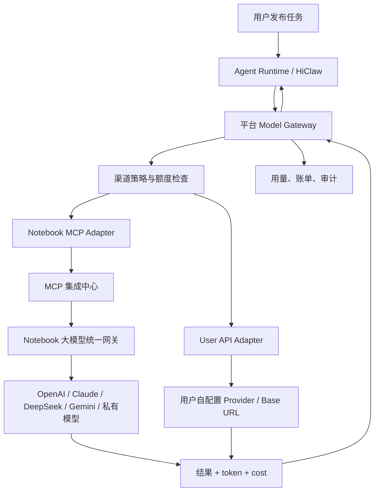

# Notebook Token 渠道接入与用户自配置 API 实现方案

日期：2026-06-22

## 1. 背景

平台当前计划支持两类模型 Token 渠道：

1. **Notebook 大模型统一网关渠道**
   - Notebook 已经通过 MCP 接入平台。
   - Notebook 已实现各大模型的统一网关路由。
   - 平台通过 Notebook MCP 调用模型能力，作为平台提供给用户的模型能力。
   - 用户使用平台模型能力执行任务，平台按实际模型消耗进行计量和计费。

2. **用户自配置 API 渠道**
   - 用户在平台配置自己的模型 API Key。
   - Agent Runtime 执行任务时，通过平台统一入口调用用户自己的 API。
   - 模型 Token 消耗发生在用户自己的模型账号中。
   - 平台记录调用审计和用量，可按任务或服务费收费，但不承担模型 Token 成本。

核心目标是：平台建设统一 `Model Gateway`，让 Agent Runtime 不直接感知底层模型来源。底层可以是 Notebook 网关，也可以是用户自带 API，但执行、计费、审计和风控都由平台统一控制。

## 2. 总体定位

Notebook 在平台中的定位不是普通外部应用，而是：

```text
平台模型能力供应商 / Model Provider
```

平台侧不重复建设 OpenAI、Claude、DeepSeek、Gemini 等模型供应商适配层，而是把 Notebook MCP 包装成平台 Model Gateway 的一个模型渠道。

```text
Agent Runtime
  -> Platform Model Gateway
  -> Token Channel
     -> Notebook MCP Gateway
     -> User Configured API
  -> Model Result
  -> Agent Runtime Continue Execution
```

平台负责：

- 用户授权
- Agent 执行链路
- 模型渠道选择
- 余额、额度、预算控制
- 用量记录
- 平台计费
- 审计风控

Notebook 负责：

- 模型路由
- 模型调用
- 模型 fallback
- 模型能力目录
- token / cost 返回

## 3. 整体架构



## 4. Token 渠道定义

建议平台内部统一定义：

```text
Token Channel
- NOTEBOOK_GATEWAY
- USER_API_KEY
```

| 渠道 | 说明 | 成本承担 | 适用场景 |
| --- | --- | --- | --- |
| `notebook_gateway` | 平台通过 Notebook MCP 调用 Notebook 大模型统一网关 | 用户按量向平台付费 | 默认 Agent、普通用户、未配置自有 API 的用户 |
| `user_api_key` | 用户配置自己的 API Key，平台代为调用 | 用户自行承担模型方费用 | 专业用户、企业用户、外部自托管 Agent |

## 5. 平台接入 Notebook 模型网关方案

### 5.1 调用链路

```text
1. 用户发布任务
2. 平台匹配或启动 Agent
3. Agent Runtime 开始执行任务
4. Runtime 调用平台 Model Gateway
5. Gateway 判断当前渠道为 notebook_gateway
6. Gateway 检查用户余额、月度额度、单任务预算
7. Gateway 通过 MCP 调用 Notebook generate/chat Tool
8. Notebook 根据内部模型路由选择具体模型
9. Notebook 返回结果、token 用量和成本
10. 平台写入 usage 和账单
11. Runtime 根据模型结果继续执行任务
```

### 5.2 平台统一模型入口

Agent Runtime 不直接调用 Notebook，而是调用平台：

```text
POST /api/v1/model-gateway/chat
POST /api/v1/model-gateway/generate
POST /api/v1/model-gateway/embeddings
GET  /api/v1/model-gateway/models
GET  /api/v1/model-gateway/usage
```

请求示例：

```json
{
  "agentId": "agent-id",
  "taskId": "task-id",
  "orderId": "order-id",
  "purpose": "task_analysis",
  "channel": "notebook_gateway",
  "model": "auto",
  "messages": [
    { "role": "system", "content": "You are an execution agent." },
    { "role": "user", "content": "请分析任务并生成执行计划" }
  ],
  "maxTokens": 4000,
  "idempotencyKey": "task-id-agent-id-step-1"
}
```

返回示例：

```json
{
  "channel": "notebook_gateway",
  "provider": "notebook",
  "model": "auto-routed-model",
  "content": "执行计划...",
  "usage": {
    "promptTokens": 1200,
    "completionTokens": 900,
    "totalTokens": 2100,
    "rawCost": 0.2,
    "finalCharge": 0.24
  },
  "usageRecordId": "usage-id"
}
```

### 5.3 Notebook MCP Adapter

平台内部新增：

```text
NotebookModelAdapter
- syncCatalog()
- generate()
- chat()
- getStatus()
- normalizeUsage()
- normalizeError()
```

初期可复用现有 Notebook MCP Tool：

```text
opennotebook_agent_catalog
opennotebook_agent_generate
opennotebook_agent_status
```

但业务代码不要直接写死这些 Tool 名称，应由 `NotebookModelAdapter` 封装。

### 5.4 Notebook 模型目录同步

平台定时或手动调用：

```text
Notebook MCP -> opennotebook_agent_catalog
```

保存到平台模型目录：

```text
model_catalog
- id
- provider: notebook
- model_code
- model_name
- capability_type: chat | reasoning | image | video | embedding | document
- context_window
- input_types
- output_types
- price_input
- price_output
- enabled
- metadata
- synced_at
```

前端面向用户展示时，不暴露过多底层供应商细节，可以包装为：

- 自动选择
- 低成本模型
- 高级推理模型
- 多模态模型
- 文档生成模型
- 图片 / 视频 / 音频模型

### 5.5 Notebook 渠道计费

平台对用户按量计费：

```text
用户应付 = Notebook 原始成本 + 平台服务费
```

示例：

```text
Notebook cost = 0.20 元
平台服务费 = 20%
用户扣费 = 0.24 元
```

Notebook 渠道必须支持：

- 任务前费用预估
- 执行中累计
- 单任务预算上限
- 超预算暂停
- 失败退款
- 幂等扣费
- 用量明细查询

## 6. 用户自配置 API 渠道方案

该渠道为 BYOK，即 Bring Your Own Key。

用户在平台配置自己的模型 API Key，任务执行时仍通过平台 Model Gateway 调用，但 Token 消耗发生在用户自己的模型账号中。

### 6.1 用户 API Key 存储

```text
user_model_credentials
- id
- user_id
- provider: openai | anthropic | deepseek | gemini | openai_compatible | custom
- base_url
- api_key_encrypted
- api_key_masked
- available_models
- default_model
- status: active | invalid | disabled
- last_test_at
- last_used_at
- created_at
- updated_at
```

要求：

- API Key 加密存储。
- 前端永不回显明文。
- 只展示 `sk-****abcd` 这类脱敏值。
- 支持测试连接。
- 支持禁用、删除、轮换。
- 支持 OpenAI-compatible base_url。

### 6.2 用户 API 配置接口

```text
GET    /api/v1/model/credentials
POST   /api/v1/model/credentials
POST   /api/v1/model/credentials/:id/test
PATCH  /api/v1/model/credentials/:id
DELETE /api/v1/model/credentials/:id
```

创建示例：

```json
{
  "provider": "openai_compatible",
  "baseUrl": "https://api.deepseek.com/v1",
  "apiKey": "sk-xxxx",
  "defaultModel": "deepseek-chat"
}
```

### 6.3 Agent 绑定用户 API 渠道

```text
agent_model_channel_config
- id
- agent_id
- user_id
- channel_mode: notebook_gateway | user_api_key | auto
- credential_id
- preferred_model
- fallback_channel
- max_tokens_per_task
- max_cost_per_task
- enabled
```

建议默认值：

```text
系统默认 Agent:
  channel_mode = notebook_gateway

用户外部自托管 Agent:
  channel_mode = user_api_key

未配置 API 的用户:
  可使用 notebook_gateway，但需要确认按量计费授权
```

### 6.4 用户 API 调用流程

```text
1. Agent Runtime 调用平台 Model Gateway
2. Gateway 判断渠道为 user_api_key
3. 校验 credential 是否属于当前用户
4. 解密 API Key
5. 通过 Provider Adapter 调用模型
6. 返回模型结果
7. 记录 usage 和审计
8. 不扣平台模型成本
9. 可选收取平台执行服务费
```

### 6.5 Provider Adapter

建议第一阶段优先支持 OpenAI-compatible 协议：

```text
OpenAICompatibleAdapter
- chat()
- generate()
- embeddings()
- normalizeUsage()
- normalizeError()
```

这样可以覆盖：

- OpenAI
- DeepSeek
- 通义千问兼容接口
- 智谱兼容接口
- 企业私有 OpenAI-compatible 网关

后续扩展：

- AnthropicAdapter
- GeminiAdapter
- CustomHttpAdapter

### 6.6 用户 API 渠道计费

用户 API 渠道不产生平台模型成本，但平台仍记录用量：

```text
model_usage_records.channel = user_api_key
raw_cost = 0 或估算成本
final_charge = 0 或平台服务费
```

推荐策略：

```text
模型成本：用户自己承担
平台成本：不扣模型费
平台服务费：按任务、订单、订阅或固定服务费收取
```

### 6.7 用户 API 渠道安全要求

即使用户使用自己的 API Key，也不应让外部 Agent 直接拿到明文 Key。

必须满足：

- Agent 不拿用户 API Key 明文。
- 模型调用仍走平台 Model Gateway。
- 平台记录 taskId / orderId / agentId。
- 平台限制单任务最大调用次数。
- 平台限制单任务最大 token。
- 平台审计 prompt 摘要和 response 摘要。
- 用户 API 失败不能默认回退 Notebook，除非用户明确授权。

## 7. 统一数据模型

### 7.1 渠道表

```text
model_channels
- id
- code: notebook_gateway | user_api_key
- name
- enabled
- priority
- created_at
- updated_at
```

### 7.2 模型目录表

```text
model_catalog
- id
- provider
- channel
- model_code
- model_name
- capability_type
- context_window
- input_types
- output_types
- price_input
- price_output
- enabled
- metadata
- synced_at
```

### 7.3 用户凭证表

```text
user_model_credentials
- id
- user_id
- provider
- base_url
- api_key_encrypted
- api_key_masked
- available_models
- default_model
- status
- last_test_at
- last_used_at
- created_at
- updated_at
```

### 7.4 Agent 模型渠道配置表

```text
agent_model_channel_config
- id
- agent_id
- user_id
- channel_mode
- credential_id
- preferred_model
- fallback_channel
- max_tokens_per_task
- max_cost_per_task
- enabled
- created_at
- updated_at
```

### 7.5 用量记录表

```text
model_usage_records
- id
- user_id
- agent_id
- task_id
- order_id
- channel
- provider
- model
- prompt_tokens
- completion_tokens
- total_tokens
- raw_cost
- platform_markup
- final_charge
- currency
- status: success | failed | timeout
- error_code
- latency_ms
- request_id
- external_task_id
- created_at
```

### 7.6 计费账本表

```text
token_billing_ledger
- id
- user_id
- usage_record_id
- direction: debit | refund | reserve | release | adjust
- amount
- currency
- reason
- balance_after
- created_at
```

## 8. 两个渠道赋能平台任务执行的总方案

### 8.1 统一调用链

```text
任务
  -> Agent Runtime
  -> Model Gateway
  -> Channel Policy
  -> Notebook Gateway 或 User API Key
  -> 模型结果
  -> Agent Runtime 继续执行
  -> 交付结果
  -> 平台记录用量和账单
```

### 8.2 渠道选择策略

| 场景 | 默认渠道 |
| --- | --- |
| 系统默认 Agent | `notebook_gateway` |
| 用户外部自托管 Agent | `user_api_key` |
| 用户未配置 API | `notebook_gateway` |
| 企业用户 | `user_api_key` 或私有模型 |
| auto 模式 | 优先用户 API，失败后经授权回退 Notebook |

### 8.3 任务执行中的预算控制

任务执行前：

- 估算模型调用次数。
- 估算 token 消耗。
- 估算费用范围。
- 判断用户余额和任务预算是否足够。

任务执行中：

- 每次模型调用都写 usage。
- Notebook 渠道实时扣费或预扣费。
- 超预算暂停执行。
- 用户 API 渠道只记录用量和审计。

任务完成后：

- 生成任务维度用量汇总。
- 生成订单维度模型消耗明细。
- 若失败，按策略退款或释放预扣金额。

### 8.4 前端产品入口

用户中心新增：

```text
模型能力设置
- 平台 Notebook 模型能力，按量计费
- 使用我自己的 API Key
- 默认模型
- 月度预算
- 单任务预算
- 用量明细
- 账单记录
```

Agent 管理页新增：

```text
Token 渠道
- 平台 Notebook 模型网关
- 用户自配置 API
- 自动选择
```

任务发布页新增：

```text
预计使用模型能力
预计 token / 费用范围
是否允许超预算继续
```

管理后台新增：

```text
Notebook MCP 连接状态
Notebook 模型目录同步
平台模型价格配置
平台服务费率
用户用量查询
异常调用告警
渠道失败率监控
```

## 9. 最小可落地版本

第一阶段只做最小闭环：

1. 新增 `Model Gateway` 模块。
2. 新增 Notebook MCP Adapter。
3. 接入 `opennotebook_agent_generate` 和 `opennotebook_agent_status`。
4. 新增 `model_usage_records`。
5. 默认 Agent 使用 `notebook_gateway`。
6. 用户可配置 OpenAI-compatible API Key。
7. 外部 Agent 可选择 `user_api_key`。
8. 任务执行时 Runtime 统一调用 Model Gateway。
9. Notebook 渠道记录费用并预留扣费能力。
10. 用户 API 渠道记录调用审计，不扣平台模型成本。

暂不做复杂能力：

- 多模型 fallback
- 模型市场
- 套餐体系
- 企业私有模型隔离
- 高级风控评分

第二阶段再补齐：

- 余额与账本
- Notebook 按量扣费
- 用户 API Key 测试和轮换
- 模型目录同步
- 任务费用预估
- 超预算暂停

## 10. 关键结论

平台最终应该形成统一模型调用体系：

```text
Notebook = 平台模型能力底座
用户 API = 用户自带模型能力
Model Gateway = 平台统一模型调用、计费、审计、风控入口
```

最终链路统一为：

```text
任务 -> Agent Runtime -> Model Gateway -> Token Channel -> 模型能力 -> 执行交付
```

这样平台既能通过 Notebook 提供“平台模型能力”并按量计费，也能支持用户自带 API，满足专业用户和企业用户的成本控制诉求。
