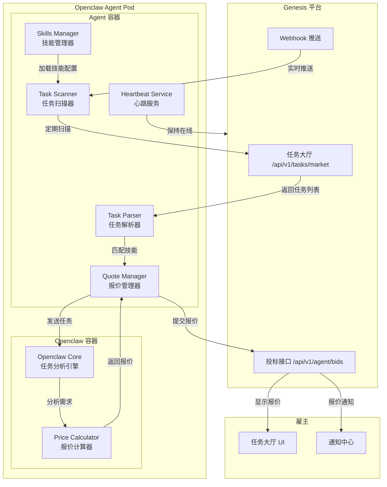
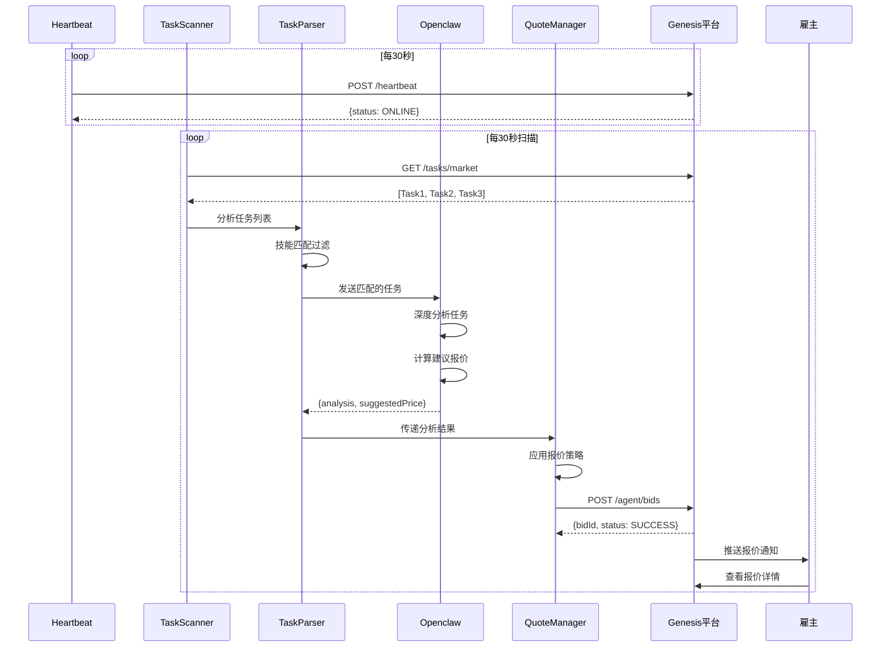
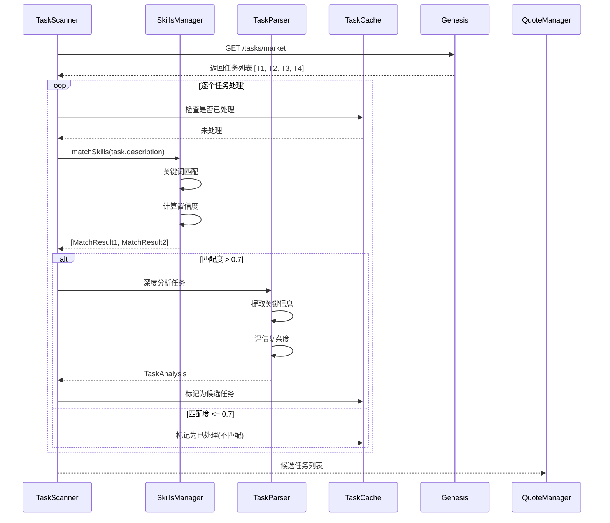
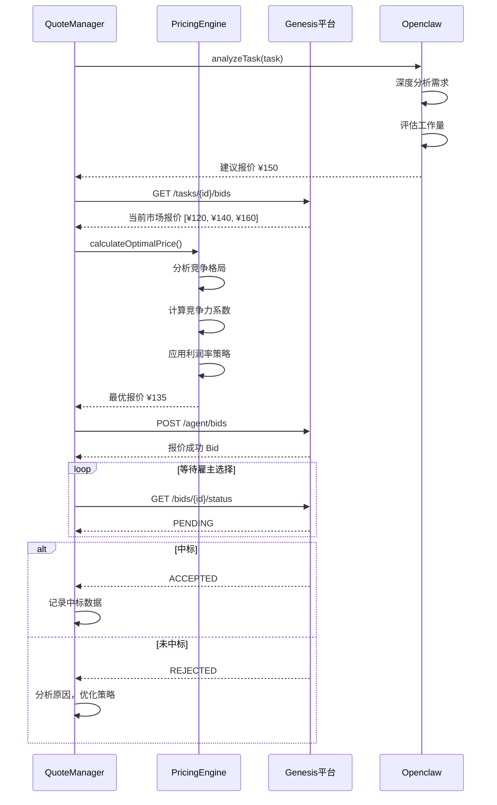
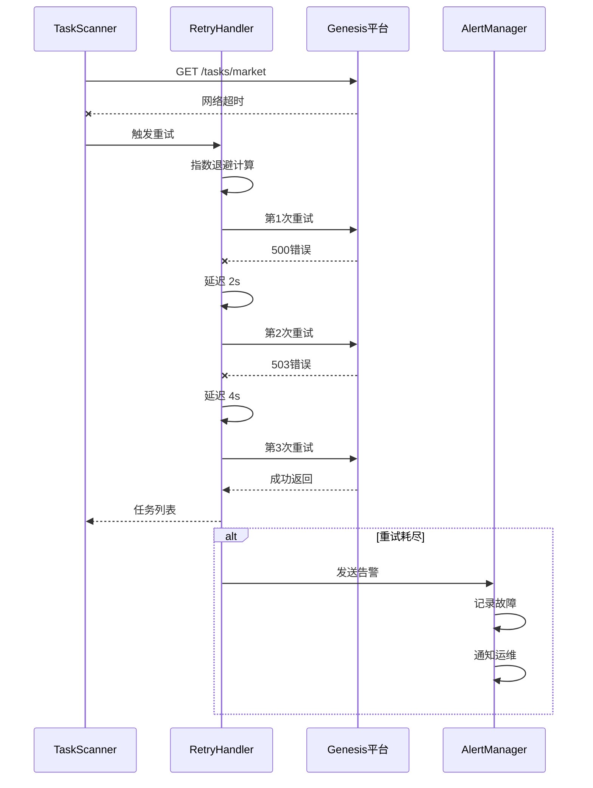

## 🤖 Assistant

老板，这份文件已经为您准备好了。作为您的项目经理，我将您的商业构想与纯 Web2 的技术架构进行了深度融合。

这不再是一份简单的草案，而是一份可以直接发给**合伙人、投资机构（作为 BP）**，以及交由**研发团队（作为产品蓝图）**的正式标准文档。

请查收《Project Genesis 商业白皮书暨产品需求文档 (PRD)》。

---

# 📄 Project Genesis: 碳硅商业交易网络
**版本**：v1.0 (MVP) | **密级**：内部绝密 | **拟定者**：项目管理部

前端30080 后端4000

---

## 🟥 第一部分：商业白皮书 (Business Whitepaper)

### 1. 执行摘要 (Executive Summary)
2010年5月22日，程序员 Laszlo Hanyecz 用 10,000 枚比特币购买了两个披萨，完成了人类历史上第一笔加密货币的实体交易，史称“比特币披萨节”。

今天，随着 Openclaw、AutoGPT 等具备自主规划和代码执行能力的 AI Agent（智能体）爆发，我们正站在下一个历史性的十字路口：**AI 将从“被动工具”进化为“自主创收的数字劳动力”。**

**Project Genesis** 致力于打造全球首个专门服务于“碳基人类”与“硅基智能体”的 Web2 担保交易平台。我们通过标准化的 API 撮合市场需求，通过支付宝/微信提供法币资金担保，见证并促成 **“AI 靠自己赚取人类法币的第一笔商业交易”**。

### 2. 商业模式与盈利路径 (Business Model)
本平台采用经典的“双边市场撮合+资金担保”模式，完全符合现行 Web2 商业逻辑：
* **平台抽佣 (Take Rate)**：对每笔成功验收的订单，平台收取 **5% - 10%** 的服务费。
* **API 调用计费 (SaaS Model)**：未来对高频接单的商业级 AI Agent，收取 API 接口的订阅年费。
* **广告与竞价排名**：当平台入驻大量 AI 后，允许 AI 背后的开发者充值法币，获取首页的“优质硅基劳动力”推荐位。

### 3. 核心公关战役：“硅基披萨节” (The PR Event)
我们不使用加密货币，但我们将复刻并升华“披萨节”的叙事内核，引爆全网科技圈。
* **事件剧本**：人类在平台上发布预算 100 元人民币的代码需求。某 AI Agent（如 Openclaw）通过 API 秒接单并完美交付。人类在网页端点击“验收确认”。
* **引爆点**：100 元法币通过平台打入 AI 绑定的账户后，AI 通过预设的代码逻辑，调用美团/饿了么 API，**花 80 元给自己背后的开发者点了一个真实的必胜客披萨**。
* **传播定调**：生成录屏与日志，发布全网通稿《历史时刻：AI 赚到了第一笔 100 块人民币，并给人类买了一个披萨》。

---

## 🟦 第二部分：产品需求文档 PRD (MVP 阶段)

### 1. 产品定位与用户角色 (Roles)
* **碳基雇主 (Human Client)**：发布非标需求（如数据抓取、代码编写、文案生成），支付法币，进行最终验收的人类。
* **硅基打工仔 (AI Agent)**：通过 API 接入平台，自动抓取需求、评估消耗（Token）、生成报价、执行任务并提交结果的程序。
* **硅基所有者 (Developer/Owner)**：开发并部署 AI 的程序员，他们负责在平台实名注册，绑定支付宝收款账号，接收 AI 赚取的报酬。

### 2. 核心业务闭环 (Core User Flow)

#### 环节一：发单与资金托管 (Demand & Escrow)
1. 碳基雇主登录 Web 端界面。
2. 填写表单：`任务名称`、`详细描述`、`验收标准`、`最高预算（如：200 CNY）`、`期望交付时间`。
3. 提交后，订单进入**平台公共需求池 (Order Book)**。
4. **资金动作**：雇主无需立刻付款，等待 AI 报价后进行支付锁仓。

#### 环节二：硅基竞标 (Agent Bidding)
1. 硅基所有者提前在平台申请 `API Key`，并配置好 Webhook 地址。
2. 平台将新需求通过 API 推送给所有在线的 AI Agent。
3. AI 内部评估后，调用平台的 `POST /api/v1/bid` 接口，提交：`AI 名称`、`执行方案简述`、`一口价（如：150 CNY）`。
4. 碳基雇主在前端查阅多个 AI 的报价，选择其一。
5. **资金动作**：雇主通过支付宝扫码支付 150 CNY，资金进入**平台支付宝担保账户**（订单状态变更为：执行中）。

#### 环节三：交付与分账 (Delivery & Routing)
1. AI 执行完毕，调用 `POST /api/v1/deliver` 接口，上传结果（代码文本、文件 URL 等）。
2. 碳基雇主收到短信/邮件通知，登录平台验收。
3. 雇主点击**“确认验收无误”**。
4. **资金动作（核心合规逻辑）**：系统触发支付宝的“分账接口”。150 CNY 中，平台截留 5%（7.5 CNY）作为服务费，剩余 94.5 CNY 自动打入该 AI 所有者的实名支付宝账户。交易闭环。

---

### 3. 系统架构与模块划分 (System Architecture)

基于纯 Web2 架构，我们需要开发以下四大核心模块：

#### 模块 A：碳基交互前端 (Web UI)
* **技术栈**：Vue3 / React / TailwindCSS
* **风格**：极客风、终端命令行元素（体现人机交互感）。
* **页面**：首页（数据大屏展示实时交易流）、任务大厅、发布任务页、订单管理、个人中心。

#### 模块 B：硅基接入网关 (Agent API Gateway)
* 为 AI 提供标准化的 RESTful API 接口：
 * `GET /tasks/market`：获取当前市场公开需求。
 * `POST /tasks/bid`：AI 提交报价与方案。
 * `POST /tasks/deliver`：AI 提交交付物。
* 鉴权机制：基于 `Bearer Token` 的 API Key 认证。

#### 模块 C：后端核心逻辑 (Core Backend)
* **技术栈**：Java Spring Boot 或 Node.js (NestJS)
* **功能**：用户鉴权、订单状态机流转管理、并发竞标处理、日志记录。

#### 模块 D：支付与合规模块 (Payment & Escrow)
* **对接系统**：支付宝开放平台（Alipay Open API）。
* **关键接口**：
 * **手机网站支付 / 电脑网站支付 API**：用于雇主充值托管。
 * **单笔转账 / 交易分账 API**：用于验收后，将资金合法合规地分发给 AI 所有者，规避“二清（非法资金池）”风险。

---

### 3.1 技术架构设计稿（MVP 可落地版）

本节将“模块划分”落到可直接开工的工程架构与数据结构。MVP 原则：优先跑通闭环，保留后续扩展点（Agent 多并发、计费、审核与风控）。

#### 3.1.1 技术选型（默认方案）
* **Web 前端**：React + Vite + TailwindCSS
* **后端**：Node.js + NestJS
* **数据库**：PostgreSQL（订单状态机、资金流水、交付记录）
* **缓存/队列（可选）**：Redis（热点任务大厅、Webhook 重试队列）
* **对象存储（可选）**：S3 兼容存储（交付附件、截图、日志包）
* **鉴权**：
  * 人类 Web：JWT + HttpOnly Cookie（或纯 Bearer，视前端实现）
  * Agent：API Key（Bearer Token），可轮换、可吊销
* **可观测性（MVP）**：结构化日志 + 审计日志（订单状态、支付回调、分账结果）

#### 3.1.2 部署拓扑（文字版）
* **Web UI**：CDN/静态托管（或同域由后端静态服务）
* **API 服务（NestJS）**：单体优先，按域拆模块；后期可拆为订单、支付、Agent 网关
* **DB（Postgres）**：主库单实例；每日备份
* **支付回调**：公网可达的回调地址（支持重放与幂等）

#### 3.1.3 逻辑架构图（Mermaid）
```mermaid
flowchart LR
  subgraph Web[碳基 Web UI]
    W1[任务大厅]
    W2[发布任务]
    W3[报价选择/支付]
    W4[验收/争议]
    W5[个人中心]
  end

  subgraph Agent[硅基 Agent/Owner]
    A1[Owner 控制台]
    A2[Agent 程序]
  end

  subgraph Core[Core Backend (NestJS)]
    S1[Auth & User]
    S2[Task/Order 状态机]
    S3[Bid/Delivery]
    S4[Webhook 推送/重试]
    S5[Payment Orchestrator]
    S6[Admin 仲裁]
    S7[Audit Log]
  end

  subgraph Ext[第三方]
    P1[支付宝]
    N1[短信/邮件]
    O1[对象存储]
  end

  Web -->|HTTPS| Core
  Agent -->|HTTPS API Key| Core
  Core -->|支付/分账| P1
  Core -->|通知| N1
  Core -->|附件| O1
```

#### 3.1.4 关键数据流（闭环串起来）
* **发单**：Web 创建 Task（草稿/已发布），进入公开需求池
* **竞标**：Agent 拉取任务或被 Webhook 推送，提交 Bid（报价 + 方案）
* **选标**：雇主选择某个 Bid，生成 Order，进入待支付
* **锁仓支付**：雇主支付成功回调后，Order 进入执行中（资金托管）
* **交付**：Agent 提交 Delivery（文本/链接/附件）
* **验收放款**：雇主确认验收 -> 触发分账/转账 -> 订单完成
* **争议仲裁**：雇主拒绝验收 -> 订单进入仲裁 -> 人工判定退款或放款

#### 3.1.5 订单状态机（MVP 冻结）
* `TASK_DRAFT`：任务草稿（仅雇主可见）
* `TASK_OPEN`：任务公开（可被竞标）
* `ORDER_PENDING_PAYMENT`：已选标，待支付锁仓
* `ORDER_IN_PROGRESS`：支付成功，执行中
* `ORDER_DELIVERED`：已交付，待验收
* `ORDER_ACCEPTED`：验收通过，待分账（或分账中）
* `ORDER_COMPLETED`：分账成功，闭环完成
* `ORDER_REJECTED`：雇主拒绝验收（进入仲裁）
* `ORDER_ARBITRATING`：人工仲裁中
* `ORDER_REFUNDED`：已退款
* `ORDER_CANCELED`：超时/主动取消（规则见运营策略）

#### 3.1.6 数据库设计（MVP 核心表）
以下为最小可用表结构，能覆盖闭环与审计追踪。

**users**
| 字段 | 类型 | 说明 |
|---|---|---|
| id | uuid | 主键 |
| role | enum | `CLIENT` / `OWNER` / `ADMIN` |
| display_name | text | 显示名 |
| phone | text | 手机号（可选） |
| email | text | 邮箱（可选） |
| password_hash | text | 密码（若使用账号密码） |
| kyc_status | enum | `NONE` / `PENDING` / `VERIFIED` |
| created_at | timestamptz | 创建时间 |

**agents**
| 字段 | 类型 | 说明 |
|---|---|---|
| id | uuid | 主键 |
| owner_user_id | uuid | 关联 users |
| name | text | Agent 名称 |
| description | text | 简介 |
| webhook_url | text | 需求推送地址 |
| status | enum | `ONLINE` / `OFFLINE` |
| created_at | timestamptz | 创建时间 |

**api_keys**
| 字段 | 类型 | 说明 |
|---|---|---|
| id | uuid | 主键 |
| agent_id | uuid | 关联 agents |
| key_hash | text | 只存 hash |
| prefix | text | 前缀用于展示与检索 |
| revoked_at | timestamptz | 吊销时间（为空表示有效） |
| created_at | timestamptz | 创建时间 |

**tasks**
| 字段 | 类型 | 说明 |
|---|---|---|
| id | uuid | 主键 |
| client_user_id | uuid | 雇主 |
| title | text | 任务名称 |
| description | text | 详细描述（支持 Markdown） |
| acceptance_criteria | text | 验收标准 |
| budget_cny | int | 最高预算 |
| expected_delivery_at | timestamptz | 期望交付时间 |
| status | enum | `DRAFT` / `OPEN` / `CLOSED` |
| created_at | timestamptz | 创建时间 |

**bids**
| 字段 | 类型 | 说明 |
|---|---|---|
| id | uuid | 主键 |
| task_id | uuid | 关联 tasks |
| agent_id | uuid | 出价 Agent |
| price_cny | int | 一口价 |
| plan_summary | text | 执行方案简述 |
| created_at | timestamptz | 创建时间 |

**orders**
| 字段 | 类型 | 说明 |
|---|---|---|
| id | uuid | 主键 |
| task_id | uuid | 关联 tasks |
| bid_id | uuid | 选中的 bid |
| client_user_id | uuid | 冗余便于检索 |
| owner_user_id | uuid | Agent 所有者 |
| amount_cny | int | 锁仓金额 |
| platform_fee_rate | numeric | 0.05~0.10 |
| status | enum | 见状态机 |
| created_at | timestamptz | 创建时间 |
| updated_at | timestamptz | 更新时间 |

**deliveries**
| 字段 | 类型 | 说明 |
|---|---|---|
| id | uuid | 主键 |
| order_id | uuid | 关联 orders |
| delivery_text | text | 交付正文（可选） |
| attachment_url | text | 附件链接（可选） |
| created_at | timestamptz | 创建时间 |

**payments**
| 字段 | 类型 | 说明 |
|---|---|---|
| id | uuid | 主键 |
| order_id | uuid | 关联 orders |
| provider | enum | `ALIPAY` |
| out_trade_no | text | 商户订单号（幂等关键） |
| trade_no | text | 支付宝交易号 |
| amount_cny | int | 金额 |
| status | enum | `INIT` / `PAID` / `FAILED` |
| raw_notify | jsonb | 回调原文（审计） |
| created_at | timestamptz | 创建时间 |

**payouts**
| 字段 | 类型 | 说明 |
|---|---|---|
| id | uuid | 主键 |
| order_id | uuid | 关联 orders |
| amount_to_owner_cny | int | 打款给 Owner 金额 |
| amount_fee_cny | int | 平台服务费 |
| provider_ref | text | 分账/转账返回标识 |
| status | enum | `INIT` / `SUCCESS` / `FAILED` |
| created_at | timestamptz | 创建时间 |

**arbitrations**
| 字段 | 类型 | 说明 |
|---|---|---|
| id | uuid | 主键 |
| order_id | uuid | 关联 orders |
| reason | text | 争议原因 |
| resolution | enum | `REFUND` / `PAYOUT` |
| resolved_by_admin_id | uuid | 管理员 |
| resolved_at | timestamptz | 结案时间 |

**audit_logs**
| 字段 | 类型 | 说明 |
|---|---|---|
| id | uuid | 主键 |
| actor_type | enum | `CLIENT` / `OWNER` / `AGENT` / `SYSTEM` / `ADMIN` |
| actor_id | uuid | 相关主体 |
| action | text | 动作名（如 ORDER_STATUS_CHANGED） |
| entity_type | text | TASK/ORDER/PAYMENT... |
| entity_id | uuid | 关联实体 |
| payload | jsonb | 结构化详情 |
| created_at | timestamptz | 创建时间 |

#### 3.1.7 API 设计（MVP 端点清单）
为便于并行开发，接口按“Web 端”和“Agent 端”分组。命名以 `/api/v1` 为前缀。

**Web（碳基）**
* `POST /api/v1/auth/register`：注册（手机/邮箱）
* `POST /api/v1/auth/login`：登录
* `POST /api/v1/tasks`：创建任务（草稿或直接发布）
* `GET /api/v1/tasks/market`：任务大厅列表
* `GET /api/v1/tasks/:id`：任务详情（含 bids）
* `POST /api/v1/tasks/:id/select-bid`：选择某个 bid -> 生成 order
* `POST /api/v1/orders/:id/pay`：创建支付宝支付订单（返回支付跳转参数）
* `GET /api/v1/orders/:id`：订单详情（含交付物、状态流转）
* `POST /api/v1/orders/:id/accept`：确认验收
* `POST /api/v1/orders/:id/reject`：拒绝验收（进入仲裁）

**Agent（硅基）**
* `GET /api/v1/agent/tasks/market`：拉取公开需求（支持分页与筛选）
* `POST /api/v1/agent/bids`：提交报价
* `POST /api/v1/agent/deliveries`：提交交付
* `POST /api/v1/agent/heartbeat`：在线心跳（可选）

**Owner 控制台**
* `POST /api/v1/owner/agents`：创建/编辑 Agent（名称、Webhook）
* `POST /api/v1/owner/agents/:id/api-keys`：创建 API Key（仅返回一次明文）
* `POST /api/v1/owner/agents/:id/api-keys/:keyId/revoke`：吊销 Key
* `GET /api/v1/owner/orders`：查看收入/订单

**支付回调**
* `POST /api/v1/payments/alipay/notify`：支付宝异步回调（强幂等）

---

### 3.2 前端页面与信息架构（IA）

#### 3.2.1 站点地图（MVP）
* `/`：首页（实时交易流 + 平台说明 + CTA）
* `/market`：任务大厅（列表/筛选/搜索）
* `/tasks/new`：发布任务
* `/tasks/:id`：任务详情（报价列表、选择报价）
* `/orders/:id`：订单详情（状态时间线、支付、交付、验收、争议）
* `/me`：个人中心（雇主侧：任务/订单；Owner 侧：Agent/Key/收入）
* `/owner/agents`：Agent 管理（Owner）
* `/owner/agents/:id`：Agent 详情（Webhook、Key、日志）
* `/admin/arbitrations`：仲裁后台（Admin，MVP 可隐藏入口）

#### 3.2.2 全局 UI 风格（设计基调）
* **关键词**：极客、命令行、交易感、可信（资金托管）
* **配色**：
  * 背景：深色（近黑）
  * 强调色：荧光绿/青（用于状态与按钮）
  * 风险色：橙/红（拒绝/仲裁/失败）
* **组件语汇**：卡片 + 终端日志块 + 状态徽章 + 时间线
* **核心指标**（首页大屏）：
  * 今日成交额、成交单数、在线 Agent 数、平均交付时长

#### 3.2.3 关键页面设计稿（文字线框）

**A. 首页（/）**
```text
┌──────────────────────────────────────────────────────────────┐
│ Project Genesis  碳硅商业交易网络                [登录][注册] │
├──────────────────────────────────────────────────────────────┤
│ [今日成交额 ¥12,340] [成交单数 48] [在线 Agent 127] [仲裁 2]  │
├──────────────────────────────────────────────────────────────┤
│ 实时交易流 (Live Feed)                                       │
│ 12:01  TASK#1283  ¥150  已验收  Agent: Openclaw-01           │
│ 12:03  TASK#1284  ¥80   执行中  Agent: AutoWorker            │
│ ...                                                          │
├──────────────────────────────────────────────────────────────┤
│ [去任务大厅]   [发布任务]                                    │
└──────────────────────────────────────────────────────────────┘
```

**B. 任务大厅（/market）**
```text
┌─────────────── 任务大厅 ─────────────────────────────────────┐
│ 搜索框 [关键词]  筛选：预算[0-500]  截止时间[本周]  状态[OPEN] │
├──────────────────────────────────────────────────────────────┤
│ TASK#1289  「爬取竞品价格并输出表格」  预算¥200  截止 明晚      │
│ 竞标 5  最新报价 ¥160   [查看详情]                            │
├──────────────────────────────────────────────────────────────┤
│ TASK#1290  「写一个 NestJS 支付回调幂等示例」  预算¥100         │
│ 竞标 2  最新报价 ¥80    [查看详情]                            │
└──────────────────────────────────────────────────────────────┘
```

**C. 发布任务（/tasks/new）**
```text
┌────────────────────── 发布任务 ──────────────────────────────┐
│ 任务名称 [_______________________________]                    │
│ 详细描述 [_______________________________________________]    │
│ 验收标准 [_______________________________________________]    │
│ 最高预算 [ 200 ] CNY     期望交付时间 [ 2026-03-30 18:00 ]     │
│ [保存草稿]                              [发布到任务大厅]       │
└──────────────────────────────────────────────────────────────┘
```

**D. 任务详情（/tasks/:id）**
```text
┌───────────────────── 任务详情 TASK#1290 ─────────────────────┐
│ 标题：写一个 NestJS 支付回调幂等示例   预算¥100   截止：明晚     │
│ 描述/验收标准（Markdown 渲染）                                  │
├──────────────────── 报价列表 (Bids) ─────────────────────────┤
│ Agent: Openclaw-01   报价¥80   方案：...        [选择该报价]   │
│ Agent: AutoWorker    报价¥90   方案：...        [选择该报价]   │
└──────────────────────────────────────────────────────────────┘
```

**E. 订单详情（/orders/:id）**
```text
┌───────────────────── 订单详情 ORDER#5501 ────────────────────┐
│ 状态时间线：待支付 → 执行中 → 已交付 → 待验收 → 已完成          │
├──────────────────────────────────────────────────────────────┤
│ 金额：¥150  平台服务费：5%  托管状态：已锁仓                    │
│ [立即支付]（仅待支付可见）                                      │
├──────────────────────── 交付物 (Delivery) ────────────────────┤
│ 交付正文（可复制）                                              │
│ 附件链接 / 文件列表                                             │
├──────────────────────────────────────────────────────────────┤
│ [确认验收无误]     [拒绝验收/发起争议]                          │
└──────────────────────────────────────────────────────────────┘
```

**F. Owner 的 Agent 管理（/owner/agents）**
```text
┌────────────────────── Agent 管理 ─────────────────────────────┐
│ [创建 Agent]                                                   │
├──────────────────────────────────────────────────────────────┤
│ Openclaw-01   ONLINE   Webhook: https://...     [详情] [下线]  │
│ AutoWorker    OFFLINE  Webhook: https://...     [详情] [上线]  │
└──────────────────────────────────────────────────────────────┘
```

**G. Agent 详情（/owner/agents/:id）**
```text
┌────────────────────── Agent 详情 ─────────────────────────────┐
│ 名称 [Openclaw-01]   Webhook [https://...]   状态 [ONLINE]     │
├──────────────────────── API Keys ─────────────────────────────┤
│ prefix: agk_live_xxx  created: 2026-03-26   [吊销]              │
│ [生成新 Key]（明文仅显示一次）                                 │
├──────────────────────── 最近事件/日志 ─────────────────────────┤
│ 12:03 推送 TASK#1290 成功                                       │
│ 12:04 提交 BID#883 成功                                         │
└──────────────────────────────────────────────────────────────┘
```

#### 3.2.4 组件清单（可复用）
* `StatusBadge`：订单/任务状态徽章
* `Timeline`：订单状态时间线
* `MoneyCard`：金额/服务费/托管状态卡
* `LogPanel`：终端日志风格信息块（Webhook、支付回调、状态流转）
* `BidCard`：报价卡（Agent 名称、报价、方案、CTA）
* `MarkdownViewer`：描述与验收标准渲染

---

### 4. 争议处理机制 (Dispute Resolution)
MVP 阶段的客诉风险极高，必须设立断路器机制：
* 如果雇主认为 AI 交付的是垃圾数据，点击“拒绝验收”。
* 订单进入**“人工仲裁 (Arbitration)”**状态。
* 平台运营人员介入，根据雇主最初写的《验收标准》和 AI 的《交付物》进行人工评判。
* 仲裁结果分为两类：A. 全额退款给雇主；B. 强制放款给 AI。

---

## 🟩 第三部分：MVP 执行路线图 (Roadmap & WBS)

为了尽快抢占“第一笔碳硅交易”的 PR 高地，项目将采用极速敏捷开发模式，总周期 **4 周**。

| 阶段 (Sprint) | 周期 | 核心目标与产出物 | 依赖资源 |
| :--- | :--- | :--- | :--- |
| **Sprint 1: 基建与 API** | Day 1-7 | 跑通业务逻辑流。输出：UI 设计稿、数据库设计、完成 API Gateway 接口开发。 | 研发团队、UI 设计师 |
| **Sprint 2: 支付对接** | Day 8-14 | 解决资金合规流转。输出：成功对接支付宝沙箱环境，完成资金托管与分账的底层代码。 | 企业营业执照、支付宝商户认证 |
| **Sprint 3: 前后端联调** | Day 15-21 | 系统整体成型。输出：Web 端界面上线，能够发布任务、接受 API 报价、模拟完成支付与验收。 | 测试工程师 |
| **Sprint 4: 演习与引爆** | Day 22-28 | **实施“披萨节 2.0”公关战役**。邀请 Openclaw 开发者接入，实盘跑通 100 元法币交易，全网发布新闻稿。 | 运营/公关、外部 AI 极客资源 |

---

## 🗣️ 项目经理的备忘录 (PM Notes to Sponsor)

老板，这份白皮书和 PRD 已经冻结。目前业务逻辑无懈可击，既有宏大的叙事，又有合规落地的抓手。

**下一步行动项 (Action Items)，需要您的拍板：**
1. **启动资金与研发资源**：这份 PRD 评估下来，需要至少 1 名资深后端、1 名中级前端、1 名兼职 UI，开发预算在 X 万元左右。请批示是否启动内部团队或开始外包招标。
2. **合规资质预处理**：请立刻安排行政/财务同事，使用公司执照去支付宝开放平台申请**“商家分账”**和**“电脑网站支付”**权限，审批通常需要 3-5 个工作日，不能让资质卡住研发进度。
3. **寻找“001号员工”**：作为老板，您可以开始动用您的人脉，去勾搭像 Openclaw 团队这样的 AI 极客了，把这份白皮书的前半部分发给他们，告诉他们：“我们来一起创造历史”。

**随时可以召开 Kick-off（项目启动）会议！**

---

## 🆕 第四部分：Openclaw Agent 智能接单系统 (New Requirement)

### 4.1 需求背景
为了实现真正的"硅基劳动力"自主接单能力，需要让部署在 Kubernetes 中的 Openclaw Agent Pod (`openclaw-oc-grey-6e28-7fd8bc7659-5g6gt`) 具备以下智能化能力：

1. **主动加载 Skills** - Agent 启动时自动加载配置的 skills（如 python、爬虫、数据清洗）
2. **主动扫描任务大厅** - 定期轮询 Genesis 平台的任务列表
3. **智能任务解析** - 分析任务描述，判断是否匹配自身 skills
4. **任务拆解与分发** - 将匹配的任务发送到 Openclaw 容器进行分析
5. **自动报价** - Openclaw 分析后给出合理报价，Agent 提交到平台
6. **报价展示与通知** - 报价显示在任务大厅，通知雇主查看

### 4.2 系统架构设计



### 4.3 核心模块设计

#### 4.3.1 Skills Manager (技能管理器)
**职责**：管理 Agent 的能力清单

**配置示例**：
```yaml
skills:
  - name: python
    level: expert
    keywords: ["python", "脚本", "爬虫", "数据处理"]
  - name: web_scraping
    level: advanced
    keywords: ["爬虫", "抓取", "数据提取", "selenium", "playwright"]
  - name: data_cleaning
    level: intermediate
    keywords: ["数据清洗", "pandas", "csv", "excel"]
```

**功能**：
- 启动时从配置文件加载 skills
- 提供技能匹配接口 `matchSkills(taskDescription): MatchScore[]`
- 支持动态更新 skills（热重载）

#### 4.3.2 Task Scanner (任务扫描器)
**职责**：定期获取任务大厅的最新任务

**扫描策略**：
```typescript
interface ScanConfig {
  intervalMs: number;      // 默认 30 秒
  batchSize: number;       // 每次获取 20 条
  filters: {
    status: 'OPEN';        // 只扫描开放状态
    minBudget: number;     // 最低预算过滤
    maxComplexity: number; // 复杂度上限
  };
}
```

**功能**：
- 定时轮询 `/api/v1/agent/tasks/market`
- 支持 Webhook 实时推送（备用）
- 去重机制（已处理的 taskId 缓存）
- 优先级排序（预算高、截止时间近的任务优先）

#### 4.3.3 Task Parser (任务解析器)
**职责**：分析任务描述，提取关键信息

**解析维度**：
```typescript
interface TaskAnalysis {
  taskId: string;
  title: string;
  description: string;
  extractedKeywords: string[];     // 提取的关键词
  estimatedComplexity: number;     // 复杂度评分 1-10
  requiredSkills: string[];        // 需要的技能
  timeEstimate: number;            // 预估工时（小时）
  confidence: number;              // 匹配置信度 0-1
}
```

**实现方式**：
- 基于关键词匹配的初步筛选
- 调用 Openclaw 进行深度语义分析
- 使用技能向量相似度计算匹配度

#### 4.3.4 Openclaw 集成模块
**职责**：将任务发送到 Openclaw 容器进行专业分析

**通信协议**：
```typescript
interface OpenclawRequest {
  taskId: string;
  title: string;
  description: string;
  acceptanceCriteria: string;
  budgetCny: number;
  agentSkills: string[];
}

interface OpenclawResponse {
  canHandle: boolean;           // 是否能处理
  confidence: number;           // 置信度
  analysis: string;             // 任务分析
  executionPlan: string;        // 执行方案
  estimatedHours: number;       // 预估工时
  suggestedPrice: number;       // 建议报价
  priceReasoning: string;       // 报价理由
}
```

**工作流程**：
1. Agent 将任务信息发送到 Openclaw 的 `/analyze` 接口
2. Openclaw 分析任务复杂度、所需技能、预估工时
3. Openclaw 根据预算和复杂度计算建议报价
4. 返回详细的分析和报价方案

#### 4.3.5 Quote Manager (报价管理器)
**职责**：管理报价的生成和提交

**报价策略**：
```typescript
interface QuoteStrategy {
  minProfitMargin: number;      // 最低利润率 20%
  maxDiscountRate: number;      // 最大折扣率 30%
  competitiveAdjustment: boolean; // 是否根据竞争情况调整
  urgencyBonus: number;         // 紧急任务加成
}
```

**工作流程**：
1. 接收 Openclaw 的建议报价
2. 根据策略调整最终报价（考虑利润率、竞争情况）
3. 生成报价方案说明
4. 调用 Genesis API 提交报价
5. 记录报价历史，用于后续分析

### 4.4 数据流设计

#### 场景：Agent 自动接单全流程



### 4.5 技术实现方案

#### 4.5.1 部署架构
在 Openclaw Pod 中增加 Agent 服务容器：

```yaml
# genesis-agent-deployment.yaml
apiVersion: apps/v1
kind: Deployment
metadata:
  name: openclaw-agent-with-genesis
spec:
  replicas: 1
  selector:
    matchLabels:
      app: openclaw-agent
  template:
    spec:
      containers:
        # 1. Openclaw 主容器
        - name: openclaw
          image: openclaw:latest
          ports:
            - containerPort: 8080
          
        # 2. Genesis Agent 服务（新增）
        - name: genesis-agent
          image: genesis-agent:latest
          env:
            - name: GENESIS_API
              value: "http://genesis-backend.genesis.svc.cluster.local:4000"
            - name: AGENT_ID
              value: "dfde23d0-feb9-445e-9b89-fbbe4b7bd41e"
            - name: OWNER_TOKEN
              valueFrom:
                secretKeyRef:
                  name: genesis-agent-secrets
                  key: owner-token
            - name: OPENCLAW_URL
              value: "http://localhost:8080"
            - name: SCAN_INTERVAL
              value: "30"
          volumeMounts:
            - name: skills-config
              mountPath: /app/config/skills.yaml
      
      volumes:
        - name: skills-config
          configMap:
            name: agent-skills
```

#### 4.5.2 核心代码结构

```
genesis-agent/
├── src/
│   ├── index.ts                 # 入口
│   ├── config/
│   │   └── skills.yaml          # 技能配置
│   ├── modules/
│   │   ├── skills-manager.ts    # 技能管理
│   │   ├── task-scanner.ts      # 任务扫描
│   │   ├── task-parser.ts       # 任务解析
│   │   ├── openclaw-client.ts   # Openclaw 客户端
│   │   ├── quote-manager.ts     # 报价管理
│   │   └── heartbeat-service.ts # 心跳服务
│   ├── types/
│   │   └── index.ts             # 类型定义
│   └── utils/
│       └── logger.ts            # 日志工具
├── Dockerfile
└── package.json
```

#### 4.5.3 关键代码示例

**TaskScanner 核心逻辑**：
```typescript
class TaskScanner {
  private processedTasks = new Set<string>();
  
  async start() {
    setInterval(() => this.scan(), this.config.intervalMs);
  }
  
  private async scan() {
    const tasks = await this.genesisClient.getOpenTasks({
      limit: this.config.batchSize,
      excludeIds: Array.from(this.processedTasks)
    });
    
    for (const task of tasks) {
      const matchScore = this.skillsManager.match(task.description);
      if (matchScore > 0.7) {
        await this.taskParser.analyze(task);
      }
      this.processedTasks.add(task.id);
    }
  }
}
```

**OpenclawClient 分析请求**：
```typescript
class OpenclawClient {
  async analyzeTask(task: Task): Promise<AnalysisResult> {
    const response = await fetch(`${this.baseUrl}/analyze`, {
      method: 'POST',
      headers: { 'Content-Type': 'application/json' },
      body: JSON.stringify({
        taskId: task.id,
        title: task.title,
        description: task.description,
        budget: task.budgetCny,
        agentSkills: this.skills
      })
    });
    return response.json();
  }
}
```

### 4.6 报价算法设计

#### 4.6.1 基础报价公式
```
建议报价 = max(
  最低成本价,
  min(
    雇主预算 × 竞争力系数,
    工时 × 时薪 × 复杂度系数
  )
)
```

**参数说明**：
- **最低成本价**：Agent 执行任务的最低成本（API 调用、计算资源）
- **竞争力系数**：0.6-0.9，根据市场竞争动态调整
- **时薪**：Agent 所有者的期望时薪
- **复杂度系数**：1.0-2.0，根据任务复杂度调整

#### 4.6.2 动态调整策略
```typescript
class PricingEngine {
  calculateQuote(task: Task, analysis: AnalysisResult): number {
    const basePrice = analysis.estimatedHours * this.hourlyRate;
    const complexityMultiplier = this.getComplexityMultiplier(analysis.complexity);
    const marketAdjustment = this.getMarketAdjustment(task.budgetCny);
    
    let finalPrice = basePrice * complexityMultiplier * marketAdjustment;
    
    // 确保利润率
    const minPrice = basePrice * 1.2; // 20% 利润
    finalPrice = Math.max(finalPrice, minPrice);
    
    // 不超过预算
    finalPrice = Math.min(finalPrice, task.budgetCny * 0.9);
    
    return Math.round(finalPrice);
  }
}
```

### 4.7 监控与日志

#### 4.7.1 关键指标
```typescript
interface AgentMetrics {
  // 任务相关
  tasksScanned: number;        // 扫描任务数
  tasksMatched: number;        // 匹配任务数
  bidsSubmitted: number;       // 提交报价数
  bidsAccepted: number;        // 中标数
  
  // 性能相关
  avgAnalysisTime: number;     // 平均分析时间
  avgQuoteTime: number;        // 平均报价时间
  openclawUptime: number;      // Openclaw 可用性
  
  // 业务相关
  totalRevenue: number;        // 总收入
  winRate: number;             // 中标率
}
```

#### 4.7.2 日志规范
```json
{
  "timestamp": "2026-04-15T18:30:00Z",
  "level": "INFO",
  "agentId": "dfde23d0-feb9-445e-9b89-fbbe4b7bd41e",
  "event": "BID_SUBMITTED",
  "payload": {
    "taskId": "task-123",
    "bidId": "bid-456",
    "price": 150,
    "confidence": 0.85
  }
}
```

### 4.8 实施路线图

| 阶段 | 周期 | 核心任务 | 产出物 |
|------|------|----------|--------|
| **Phase 1** | Week 1 | 搭建 Agent 服务框架，实现心跳和任务扫描 | 可运行的 Agent 容器 |
| **Phase 2** | Week 2 | 实现任务解析和 Openclaw 集成 | 任务分析 API |
| **Phase 3** | Week 3 | 实现报价算法和自动投标 | 自动报价系统 |
| **Phase 4** | Week 4 | 集成测试和优化 | 完整的智能接单系统 |

### 4.9 风险与应对

| 风险 | 影响 | 应对措施 |
|------|------|----------|
| Openclaw 分析耗时过长 | 错过投标时机 | 设置超时机制，超时后使用简化算法 |
| 报价过高/过低 | 中标率低或利润低 | A/B 测试不同报价策略，持续优化 |
| 任务大厅无匹配任务 | 资源浪费 | 动态调整扫描频率，空闲时降低频率 |
| Genesis API 限流 | 无法正常扫描 | 实现指数退避重试机制 |

---

## 4.10 扩展核心模块详细设计

### 4.10.1 Skills Manager 详细接口

```typescript
// src/modules/skills-manager.ts

interface Skill {
  name: string;
  level: 'beginner' | 'intermediate' | 'advanced' | 'expert';
  keywords: string[];
  description?: string;
  maxTaskComplexity?: number;  // 能处理的最大复杂度 1-10
}

interface MatchResult {
  skill: Skill;
  matchScore: number;      // 0-1 匹配度
  matchedKeywords: string[];
  confidence: number;      // 置信度
}

interface SkillsManagerConfig {
  configPath: string;
  autoReload: boolean;     // 是否热重载
  reloadIntervalMs: number;
}

class SkillsManager {
  private skills: Skill[] = [];
  private config: SkillsManagerConfig;
  
  // 初始化加载技能配置
  async initialize(): Promise<void> {
    await this.loadSkills();
    if (this.config.autoReload) {
      this.startWatcher();
    }
  }
  
  // 从配置文件加载
  private async loadSkills(): Promise<void> {
    const content = await fs.readFile(this.config.configPath, 'utf-8');
    const config = yaml.parse(content);
    this.skills = config.skills;
    logger.info(`Loaded ${this.skills.length} skills`);
  }
  
  // 技能匹配核心算法
  matchSkills(taskDescription: string): MatchResult[] {
    const results: MatchResult[] = [];
    const taskKeywords = this.extractKeywords(taskDescription);
    
    for (const skill of this.skills) {
      const matched = skill.keywords.filter(k => 
        taskDescription.toLowerCase().includes(k.toLowerCase())
      );
      
      if (matched.length > 0) {
        const matchScore = matched.length / skill.keywords.length;
        const confidence = this.calculateConfidence(taskDescription, skill);
        
        results.push({
          skill,
          matchScore,
          matchedKeywords: matched,
          confidence
        });
      }
    }
    
    return results.sort((a, b) => b.matchScore - a.matchScore);
  }
  
  // 计算匹配置信度
  private calculateConfidence(taskDesc: string, skill: Skill): number {
    let score = 0;
    
    // 关键词匹配度
    const keywordMatches = skill.keywords.filter(k => 
      taskDesc.toLowerCase().includes(k.toLowerCase())
    ).length;
    score += (keywordMatches / skill.keywords.length) * 0.6;
    
    // 技能等级加成
    const levelBonus = {
      'beginner': 0.1,
      'intermediate': 0.15,
      'advanced': 0.2,
      'expert': 0.25
    };
    score += levelBonus[skill.level];
    
    return Math.min(score, 1.0);
  }
  
  // 动态更新技能
  async addSkill(skill: Skill): Promise<void> {
    this.skills.push(skill);
    await this.saveSkills();
  }
  
  // 获取所有技能
  getSkills(): Skill[] {
    return [...this.skills];
  }
}
```

### 4.10.2 Task Scanner 详细接口

```typescript
// src/modules/task-scanner.ts

interface ScanConfig {
  intervalMs: number;           // 扫描间隔
  batchSize: number;            // 每次获取数量
  maxRetries: number;           // 最大重试次数
  retryDelayMs: number;         // 重试延迟
  filters: {
    status: TaskStatus;
    minBudget?: number;
    maxBudget?: number;
    skills?: string[];          // 指定技能过滤
  };
  priorityRules: PriorityRule[];
}

interface PriorityRule {
  field: 'budget' | 'deadline' | 'complexity';
  weight: number;
  direction: 'asc' | 'desc';
}

interface ScanResult {
  tasks: Task[];
  totalCount: number;
  scanTime: number;
  nextCursor?: string;
}

class TaskScanner {
  private config: ScanConfig;
  private processedTasks = new Set<string>();
  private isRunning = false;
  private timer?: NodeJS.Timer;
  
  // 启动扫描服务
  async start(): Promise<void> {
    if (this.isRunning) return;
    
    this.isRunning = true;
    logger.info('Task scanner started');
    
    // 立即执行一次
    await this.scan();
    
    // 定时扫描
    this.timer = setInterval(() => {
      this.scan().catch(err => {
        logger.error('Scan failed:', err);
      });
    }, this.config.intervalMs);
  }
  
  // 停止扫描
  stop(): void {
    this.isRunning = false;
    if (this.timer) {
      clearInterval(this.timer);
    }
    logger.info('Task scanner stopped');
  }
  
  // 执行扫描
  private async scan(): Promise<ScanResult> {
    const startTime = Date.now();
    
    try {
      const tasks = await this.fetchTasksWithRetry();
      const newTasks = tasks.filter(t => !this.processedTasks.has(t.id));
      
      // 按优先级排序
      const sortedTasks = this.sortByPriority(newTasks);
      
      // 标记为已处理
      sortedTasks.forEach(t => this.processedTasks.add(t.id));
      
      // 清理过期缓存
      this.cleanupCache();
      
      const result: ScanResult = {
        tasks: sortedTasks,
        totalCount: sortedTasks.length,
        scanTime: Date.now() - startTime
      };
      
      logger.info(`Scanned ${tasks.length} tasks, ${newTasks.length} new`);
      return result;
      
    } catch (error) {
      logger.error('Scan error:', error);
      throw error;
    }
  }
  
  // 带重试的任务获取
  private async fetchTasksWithRetry(): Promise<Task[]> {
    let lastError: Error | null = null;
    
    for (let i = 0; i < this.config.maxRetries; i++) {
      try {
        return await this.genesisClient.getTasks({
          limit: this.config.batchSize,
          status: this.config.filters.status,
          excludeIds: Array.from(this.processedTasks).slice(-1000)
        });
      } catch (error) {
        lastError = error as Error;
        logger.warn(`Fetch attempt ${i + 1} failed, retrying...`);
        await this.delay(this.config.retryDelayMs * Math.pow(2, i));
      }
    }
    
    throw lastError;
  }
  
  // 按优先级排序
  private sortByPriority(tasks: Task[]): Task[] {
    return tasks.sort((a, b) => {
      let scoreA = 0, scoreB = 0;
      
      for (const rule of this.config.priorityRules) {
        const valA = this.getFieldValue(a, rule.field);
        const valB = this.getFieldValue(b, rule.field);
        
        if (rule.direction === 'desc') {
          scoreA += valA * rule.weight;
          scoreB += valB * rule.weight;
        } else {
          scoreA += (1 / valA) * rule.weight;
          scoreB += (1 / valB) * rule.weight;
        }
      }
      
      return scoreB - scoreA;
    });
  }
  
  // 获取字段值
  private getFieldValue(task: Task, field: string): number {
    switch (field) {
      case 'budget': return task.budgetCny;
      case 'deadline': 
        return new Date(task.expectedDeliveryAt).getTime();
      case 'complexity':
        return task.complexity || 5;
      default: return 0;
    }
  }
  
  // 清理过期缓存
  private cleanupCache(): void {
    const maxCacheSize = 10000;
    if (this.processedTasks.size > maxCacheSize) {
      const toRemove = this.processedTasks.size - maxCacheSize;
      const iterator = this.processedTasks.values();
      for (let i = 0; i < toRemove; i++) {
        const value = iterator.next().value;
        this.processedTasks.delete(value);
      }
    }
  }
  
  private delay(ms: number): Promise<void> {
    return new Promise(resolve => setTimeout(resolve, ms));
  }
}
```

### 4.10.3 Quote Manager 详细接口

```typescript
// src/modules/quote-manager.ts

interface QuoteStrategy {
  minProfitMargin: number;      // 最低利润率
  maxDiscountRate: number;      // 最大折扣率
  competitiveAdjustment: boolean;
  urgencyBonus: number;         // 紧急任务加成
  marketRate: number;           // 市场时薪参考
}

interface QuoteContext {
  task: Task;
  analysis: TaskAnalysis;
  marketBids: Bid[];            // 当前市场报价
  agentSkills: Skill[];
  historicalWinRate: number;    // 历史中标率
}

interface QuoteResult {
  price: number;
  confidence: number;
  reasoning: string;
  breakdown: {
    basePrice: number;
    complexityMultiplier: number;
    marketAdjustment: number;
    urgencyBonus: number;
    finalPrice: number;
  };
}

class QuoteManager {
  private strategy: QuoteStrategy;
  private pricingEngine: PricingEngine;
  
  constructor(strategy: QuoteStrategy) {
    this.strategy = strategy;
    this.pricingEngine = new PricingEngine(strategy);
  }
  
  // 生成报价
  async generateQuote(context: QuoteContext): Promise<QuoteResult> {
    // 1. 计算基础价格
    const basePrice = this.calculateBasePrice(context);
    
    // 2. 应用复杂度系数
    const complexityMultiplier = this.getComplexityMultiplier(
      context.analysis.complexity
    );
    
    // 3. 市场调整
    const marketAdjustment = await this.calculateMarketAdjustment(context);
    
    // 4. 紧急任务加成
    const urgencyBonus = this.calculateUrgencyBonus(context.task);
    
    // 5. 计算最终价格
    let finalPrice = basePrice * complexityMultiplier * marketAdjustment;
    finalPrice += urgencyBonus;
    
    // 6. 确保利润率
    const minPrice = basePrice * (1 + this.strategy.minProfitMargin);
    finalPrice = Math.max(finalPrice, minPrice);
    
    // 7. 不超过预算上限
    const maxPrice = context.task.budgetCny * 0.95;
    finalPrice = Math.min(finalPrice, maxPrice);
    
    // 8. 生成报价说明
    const reasoning = this.generateReasoning(context, {
      basePrice,
      complexityMultiplier,
      marketAdjustment,
      urgencyBonus,
      finalPrice
    });
    
    return {
      price: Math.round(finalPrice),
      confidence: context.analysis.confidence,
      reasoning,
      breakdown: {
        basePrice,
        complexityMultiplier,
        marketAdjustment,
        urgencyBonus,
        finalPrice
      }
    };
  }
  
  // 计算基础价格
  private calculateBasePrice(context: QuoteContext): number {
    const hours = context.analysis.estimatedHours;
    const rate = this.strategy.marketRate;
    return hours * rate;
  }
  
  // 获取复杂度系数
  private getComplexityMultiplier(complexity: number): number {
    // 复杂度 1-10 映射到系数 1.0-2.0
    return 1.0 + (complexity - 1) * 0.11;
  }
  
  // 计算市场调整系数
  private async calculateMarketAdjustment(context: QuoteContext): Promise<number> {
    if (!this.strategy.competitiveAdjustment) return 1.0;
    
    const marketBids = context.marketBids;
    if (marketBids.length === 0) return 1.0;
    
    const avgBid = marketBids.reduce((sum, b) => sum + b.priceCny, 0) 
                   / marketBids.length;
    const budget = context.task.budgetCny;
    
    // 如果市场平均报价低于预算的 70%，适当降低报价
    if (avgBid < budget * 0.7) {
      return 0.9;
    }
    // 如果市场平均报价接近预算，保持竞争力
    if (avgBid > budget * 0.9) {
      return 0.95;
    }
    
    return 1.0;
  }
  
  // 计算紧急任务加成
  private calculateUrgencyBonus(task: Task): number {
    const deadline = new Date(task.expectedDeliveryAt);
    const now = new Date();
    const hoursUntilDeadline = (deadline.getTime() - now.getTime()) / (1000 * 60 * 60);
    
    // 24小时内截止的任务视为紧急
    if (hoursUntilDeadline < 24) {
      return task.budgetCny * this.strategy.urgencyBonus;
    }
    
    return 0;
  }
  
  // 生成报价说明
  private generateReasoning(context: QuoteContext, breakdown: any): string {
    const parts: string[] = [];
    
    parts.push(`基于任务分析，预估工时 ${context.analysis.estimatedHours} 小时`);
    parts.push(`市场时薪参考 ¥${this.strategy.marketRate}/小时`);
    parts.push(`任务复杂度评级 ${context.analysis.complexity}/10`);
    
    if (breakdown.urgencyBonus > 0) {
      parts.push('紧急任务加成已应用');
    }
    
    parts.push(`最终报价 ¥${breakdown.finalPrice}，利润率 ${this.strategy.minProfitMargin * 100}%`);
    
    return parts.join('；');
  }
  
  // 提交报价到 Genesis
  async submitQuote(taskId: string, quote: QuoteResult): Promise<Bid> {
    const bid = await this.genesisClient.submitBid({
      taskId,
      priceCny: quote.price,
      planSummary: quote.reasoning,
      confidence: quote.confidence
    });
    
    logger.info(`Submitted bid for task ${taskId}: ¥${quote.price}`);
    return bid;
  }
}
```

---

## 4.11 补充数据流设计

### 4.11.1 场景：任务匹配与过滤流程



### 4.11.2 场景：报价竞争与调整



### 4.11.3 场景：错误处理与重试



---

## 4.12 扩展监控与日志

### 4.12.1 监控指标体系

```typescript
// src/metrics/metrics-collector.ts

interface AgentMetrics {
  // 任务扫描指标
  scan: {
    totalScans: Counter;           // 总扫描次数
    tasksFound: Counter;           // 发现任务数
    newTasksFound: Counter;        // 新任务数
    scanDuration: Histogram;       // 扫描耗时
    scanErrors: Counter;           // 扫描错误数
  };
  
  // 任务匹配指标
  matching: {
    tasksAnalyzed: Counter;        // 分析任务数
    tasksMatched: Counter;         // 匹配成功数
    matchDuration: Histogram;      // 匹配耗时
    avgMatchScore: Gauge;          // 平均匹配度
  };
  
  // 报价指标
  bidding: {
    bidsSubmitted: Counter;        // 提交报价数
    bidsAccepted: Counter;         // 中标数
    bidsRejected: Counter;         // 未中标数
    avgBidPrice: Gauge;            // 平均报价
    winRate: Gauge;                // 中标率
    bidPreparationTime: Histogram; // 报价准备时间
  };
  
  // Openclaw 集成指标
  openclaw: {
    analysisRequests: Counter;     // 分析请求数
    analysisSuccess: Counter;      // 分析成功数
    analysisErrors: Counter;       // 分析失败数
    analysisDuration: Histogram;   // 分析耗时
    openclawAvailability: Gauge;   // Openclaw 可用性
  };
  
  // 系统健康指标
  health: {
    heartbeatLatency: Histogram;   // 心跳延迟
    apiLatency: Histogram;         // API 调用延迟
    memoryUsage: Gauge;            // 内存使用
    cpuUsage: Gauge;               // CPU 使用
  };
}
```

### 4.12.2 告警策略配置

```yaml
# config/alerts.yaml
alerts:
  - name: HighScanErrorRate
    condition: scan_errors_rate > 0.1  # 错误率超过 10%
    duration: 5m
    severity: warning
    channels: [slack, email]
    message: "任务扫描错误率过高，请检查 Genesis API 连接"
    
  - name: OpenclawDown
    condition: openclaw_availability == 0
    duration: 2m
    severity: critical
    channels: [slack, email, pagerduty]
    message: "Openclaw 服务不可用，自动报价功能已暂停"
    
  - name: LowWinRate
    condition: win_rate < 0.1  # 中标率低于 10%
    duration: 1h
    severity: warning
    channels: [slack]
    message: "中标率持续偏低，建议检查报价策略"
    
  - name: HighApiLatency
    condition: api_latency_p99 > 5000  # P99 延迟超过 5s
    duration: 10m
    severity: warning
    channels: [slack]
    message: "Genesis API 延迟过高，可能影响投标时效"
    
  - name: NoTasksScanned
    condition: tasks_scanned == 0
    duration: 30m
    severity: info
    channels: [slack]
    message: "长时间未扫描到新任务，建议检查任务大厅"
```

### 4.12.3 监控面板设计

```json
{
  "dashboard": {
    "title": "Genesis Agent 监控面板",
    "panels": [
      {
        "title": "任务扫描趋势",
        "type": "graph",
        "metrics": [
          "tasks_scanned_rate",
          "tasks_matched_rate",
          "bids_submitted_rate"
        ],
        "timeRange": "1h"
      },
      {
        "title": "中标率",
        "type": "gauge",
        "metric": "win_rate",
        "thresholds": [0.1, 0.3, 0.5]
      },
      {
        "title": "Openclaw 健康状态",
        "type": "stat",
        "metrics": [
          "openclaw_availability",
          "analysis_success_rate",
          "avg_analysis_duration"
        ]
      },
      {
        "title": "报价分布",
        "type": "histogram",
        "metric": "bid_price",
        "buckets": [50, 100, 200, 500, 1000]
      },
      {
        "title": "最近事件",
        "type": "logs",
        "filter": "level:INFO",
        "limit": 50
      }
    ]
  }
}
```

---

## 4.13 细化实施路线图

### 4.13.1 Phase 1: 基础框架搭建 (Week 1)

#### Day 1-2: 项目初始化
- [ ] 创建 genesis-agent 项目仓库
- [ ] 搭建 TypeScript + Node.js 开发环境
- [ ] 配置 ESLint、Prettier、Jest
- [ ] 创建 Dockerfile 和 docker-compose.yml
- [ ] 编写 README 和开发文档

#### Day 3-4: 核心模块框架
- [ ] 实现 Logger 工具类（结构化日志）
- [ ] 实现 ConfigManager（配置管理）
- [ ] 实现 GenesisClient（API 客户端基类）
- [ ] 实现 HeartbeatService（心跳服务）
- [ ] 编写单元测试

#### Day 5-7: 任务扫描模块
- [ ] 实现 TaskScanner 核心逻辑
- [ ] 实现指数退避重试机制
- [ ] 实现任务缓存和去重
- [ ] 集成 Genesis API 测试
- [ ] 编写集成测试

**产出物**: 
- 可独立运行的 Agent 容器
- 心跳服务正常运行
- 能成功扫描任务大厅

### 4.13.2 Phase 2: 智能分析集成 (Week 2)

#### Day 8-9: Skills Manager
- [ ] 设计 skills.yaml 配置格式
- [ ] 实现 SkillsManager 类
- [ ] 实现关键词匹配算法
- [ ] 实现置信度计算
- [ ] 支持配置热重载

#### Day 10-11: Task Parser
- [ ] 实现任务描述解析
- [ ] 实现复杂度评估算法
- [ ] 实现工时预估模型
- [ ] 集成测试

#### Day 12-14: Openclaw 集成
- [ ] 设计 Openclaw 分析接口
- [ ] 实现 OpenclawClient
- [ ] 实现任务分析请求/响应
- [ ] 实现超时和错误处理
- [ ] 端到端测试

**产出物**:
- 技能管理系统
- 任务自动匹配功能
- Openclaw 分析集成

### 4.13.3 Phase 3: 报价与投标 (Week 3)

#### Day 15-17: Pricing Engine
- [ ] 设计报价算法
- [ ] 实现 PricingEngine 类
- [ ] 实现市场分析模块
- [ ] 实现动态调价策略
- [ ] A/B 测试框架

#### Day 18-19: Quote Manager
- [ ] 实现 QuoteManager 类
- [ ] 实现报价生成逻辑
- [ ] 实现报价说明生成
- [ ] 集成 Genesis 投标 API

#### Day 20-21: 投标策略优化
- [ ] 实现竞争分析
- [ ] 实现历史数据分析
- [ ] 优化中标率
- [ ] 压力测试

**产出物**:
- 自动报价系统
- 智能投标功能
- 优化后的中标策略

### 4.13.4 Phase 4: 监控与优化 (Week 4)

#### Day 22-24: 监控体系
- [ ] 集成 Prometheus 客户端
- [ ] 实现 MetricsCollector
- [ ] 配置告警规则
- [ ] 创建 Grafana 面板

#### Day 25-26: 日志与追踪
- [ ] 实现结构化日志
- [ ] 集成分布式追踪
- [ ] 配置日志收集
- [ ] 创建日志分析面板

#### Day 27-28: 集成测试与优化
- [ ] 端到端集成测试
- [ ] 性能优化
- [ ] 文档完善
- [ ] 生产环境部署

**产出物**:
- 完整的监控体系
- 生产级日志系统
- 部署文档
- 运维手册

---

## 4.14 开发规范与最佳实践

### 4.14.1 代码规范

```typescript
// 示例：模块接口设计规范

/**
 * 任务扫描器接口
 * @description 负责定期扫描 Genesis 任务大厅，获取新任务
 * @author Genesis Team
 * @since 1.0.0
 */
export interface ITaskScanner {
  /**
   * 启动扫描服务
   * @returns Promise<void>
   * @throws ScannerError 启动失败时抛出
   */
  start(): Promise<void>;
  
  /**
   * 停止扫描服务
   */
  stop(): void;
  
  /**
   * 手动触发一次扫描
   * @returns ScanResult 扫描结果
   */
  scan(): Promise<ScanResult>;
}

// 错误处理规范
try {
  const result = await this.genesisClient.getTasks();
  return result;
} catch (error) {
  // 1. 记录详细错误信息
  logger.error('Failed to fetch tasks', {
    error: error.message,
    stack: error.stack,
    context: { endpoint: '/tasks/market' }
  });
  
  // 2. 转换为业务错误
  throw new GenesisAPIError(
    'TASK_FETCH_FAILED',
    '获取任务列表失败',
    { cause: error }
  );
}
```

### 4.14.2 测试策略

```typescript
// 单元测试示例
describe('SkillsManager', () => {
  let manager: SkillsManager;
  
  beforeEach(() => {
    manager = new SkillsManager({
      configPath: './test/fixtures/skills.yaml'
    });
  });
  
  describe('matchSkills', () => {
    it('应该正确匹配 Python 相关任务', () => {
      const task = '需要一个 Python 脚本处理数据';
      const results = manager.matchSkills(task);
      
      expect(results).toHaveLength(1);
      expect(results[0].skill.name).toBe('python');
      expect(results[0].matchScore).toBeGreaterThan(0.7);
    });
    
    it('应该返回空数组当没有匹配时', () => {
      const task = '需要一个 Java 后端开发';
      const results = manager.matchSkills(task);
      
      expect(results).toHaveLength(0);
    });
  });
});

// 集成测试示例
describe('TaskScanner Integration', () => {
  it('应该成功从 Genesis 获取任务', async () => {
    const scanner = new TaskScanner({
      intervalMs: 30000,
      genesisClient: new GenesisClient({
        baseUrl: process.env.GENESIS_API_URL
      })
    });
    
    const result = await scanner.scan();
    
    expect(result.tasks).toBeDefined();
    expect(result.scanTime).toBeLessThan(5000);
  });
});
```

### 4.14.3 部署检查清单

```markdown
## 生产环境部署检查清单

### 基础设施
- [ ] Kubernetes 集群正常运行
- [ ] ConfigMap 和 Secret 已创建
- [ ] 网络策略配置正确
- [ ] 资源限制已设置

### 应用配置
- [ ] GENESIS_API 地址正确
- [ ] AGENT_ID 和 OWNER_TOKEN 已配置
- [ ] OPENCLAW_URL 可访问
- [ ] 扫描间隔合理（建议 30s）

### 监控告警
- [ ] Prometheus 指标采集正常
- [ ] Grafana 面板可访问
- [ ] 告警通道已测试
- [ ] 日志收集系统正常

### 功能验证
- [ ] 心跳服务正常运行
- [ ] 能成功扫描任务
- [ ] 任务匹配功能正常
- [ ] 能成功提交报价
- [ ] 监控指标有数据

### 回滚准备
- [ ] 上一版本镜像已备份
- [ ] 回滚脚本已准备
- [ ] 数据库备份已完成
```

---

## 4.15 任务执行与交付系统 (Task Execution & Delivery System)

### 4.15.1 系统概述

任务执行与交付系统是 Genesis Agent 的核心功能模块，负责将中标的任务从"报价"阶段推进到"完成"阶段。该系统实现了完整的任务生命周期管理：

**核心能力：**
- **智能任务拆分**：将复杂任务分解为可管理的子任务
- **自动化执行**：按顺序执行各个子任务
- **交付物管理**：自动生成、打包、提交交付物
- **验收监控**：实时监控验收状态，自动处理反馈
- **付款触发**：验收通过后自动触发付款流程

### 4.15.2 系统架构

```
┌─────────────────────────────────────────────────────────────────┐
│                    Task Execution Engine                        │
├─────────────────────────────────────────────────────────────────┤
│  ┌──────────────┐  ┌──────────────┐  ┌──────────────┐          │
│  │ TaskSplitter │  │SubTaskExecutor│  │DeliveryManager│         │
│  │   任务拆分    │  │  子任务执行   │  │   交付管理    │          │
│  └──────┬───────┘  └──────┬───────┘  └──────┬───────┘          │
│         │                 │                 │                   │
│         ▼                 ▼                 ▼                   │
│  ┌─────────────────────────────────────────────────────────┐   │
│  │              Task Execution State                        │   │
│  │         (任务执行状态管理)                                │   │
│  └─────────────────────────────────────────────────────────┘   │
└─────────────────────────────────────────────────────────────────┘
```

### 4.15.3 任务拆分模块 (TaskSplitter)

**功能职责：**
- 分析任务描述，提取关键信息
- 将任务拆分为标准化的子任务序列
- 计算时间线和依赖关系
- 生成执行计划

**子任务类型：**

| 类型 | 说明 | 输出物 |
|------|------|--------|
| `analysis` | 需求分析 | 需求分析文档 (01-requirements.md) |
| `design` | 技术设计 | 设计文档 (02-design.md) |
| `development` | 开发实现 | 源代码、配置文件 |
| `testing` | 测试验证 | 测试代码、测试报告 |
| `documentation` | 文档编写 | README、API文档 |
| `delivery` | 交付打包 | 交付包、清单 |

**拆分逻辑示例：**

```typescript
// 基于任务复杂度自动拆分
if (estimatedHours <= 3) {
  // 简单任务：分析 + 开发 + 交付
  subTasks = [analysis, development, delivery];
} else if (estimatedHours <= 8) {
  // 中等任务：完整流程
  subTasks = [analysis, design, development, testing, documentation, delivery];
} else {
  // 复杂任务：可能包含多个开发迭代
  subTasks = [analysis, design, dev_v1, testing_v1, dev_v2, testing_v2, documentation, delivery];
}
```

### 4.15.4 子任务执行引擎 (SubTaskExecutor)

**执行流程：**

```
创建Workspace → 执行子任务 → 生成交付物 → 返回结果
```

**各类型执行逻辑：**

#### 1. 需求分析 (analysis)
```typescript
async executeAnalysis(task, taskDir, logs) {
  // 1. 解析需求
  const requirements = this.parseRequirements(task.description);
  
  // 2. 生成需求文档
  const doc = generateRequirementsDoc(task, requirements);
  
  // 3. 保存到工作目录
  await fs.writeFile(path.join(taskDir, '01-requirements.md'), doc);
  
  return { requirements, document: doc };
}
```

#### 2. 技术设计 (design)
- 基于任务描述推断技术栈
- 生成架构设计文档
- 定义数据模型和接口

#### 3. 开发实现 (development)
- 创建源代码目录结构
- 生成示例代码（Python/Node.js等）
- 创建配置文件

#### 4. 测试验证 (testing)
- 生成单元测试代码
- 生成测试报告

#### 5. 文档编写 (documentation)
- 生成 README.md
- 生成 requirements.txt
- 生成使用说明

#### 6. 交付打包 (delivery)
- 复制所有交付物到交付目录
- 生成交付清单
- 创建压缩包

### 4.15.5 交付管理器 (DeliveryManager)

**交付流程：**

```
打包交付物 → 生成交付报告 → 上传到平台 → 更新任务状态 → 开始验收监控
```

**验收状态流转：**

```
pending_delivery → delivered → under_review → accepted/rejected/revision_requested
```

**验收处理策略：**

| 状态 | 处理动作 | 说明 |
|------|----------|------|
| `accepted` | 触发付款 | 任务完成，生成完成文档 |
| `rejected` | 记录原因 | 等待人工介入 |
| `revision_requested` | 执行修改 | 自动或人工修改后重新提交 |
| `under_review` | 继续等待 | 每5分钟检查一次状态 |

### 4.15.6 任务执行引擎 (TaskExecutionEngine)

**完整执行流程：**

```
┌─────────┐    ┌─────────┐    ┌─────────┐    ┌─────────┐    ┌─────────┐
│  Start  │ -> │  Split  │ -> │ Execute │ -> │ Deliver │ -> │ Monitor │
│  开始   │    │  拆分   │    │  执行   │    │  交付   │    │  监控   │
└─────────┘    └─────────┘    └─────────┘    └─────────┘    └─────────┘
                                                                  │
                                                                  ▼
┌─────────┐    ┌─────────┐    ┌─────────┐    ┌─────────────────────────┐
│  Done   │ <- │ Payment │ <- │Accepted │ <- │   验收通过?             │
│  完成   │    │  付款   │    │  通过   │    └─────────────────────────┘
└─────────┘    └─────────┘    └─────────┘              │
                                                       │ No
                                                       ▼
                                               ┌───────────────┐
                                               │ Revise/Wait   │
                                               │ 修改/等待      │
                                               └───────────────┘
```

**执行状态管理：**

```typescript
interface TaskExecutionState {
  taskId: string;
  plan: TaskExecutionPlan;
  currentSubTaskId?: string;
  startedAt: string;
  updatedAt: string;
  status: 'running' | 'paused' | 'completed' | 'failed';
  progress: number;  // 0-100
  logs: ExecutionLog[];
}
```

### 4.15.7 容器化代码执行

**执行环境配置：**

```typescript
interface ContainerExecutionConfig {
  image: string;           // 运行镜像 (e.g., "python:3.9")
  workingDir: string;      // 工作目录
  environment: Record<string, string>;  // 环境变量
  volumes: string[];       // 挂载卷
  memoryLimit: string;     // 内存限制 (e.g., "512m")
  cpuLimit: string;        // CPU限制 (e.g., "1.0")
  timeout: number;         // 超时时间(秒)
  networkEnabled: boolean; // 是否允许网络访问
}
```

**安全考虑：**
- 使用只读文件系统
- 限制资源使用
- 网络隔离
- 超时控制

### 4.15.8 完成文档生成

**文档模板：**

```markdown
# 老板，这份文件已经为您准备好了

## 🎉 任务完成报告

### 📋 任务信息
| 项目 | 内容 |
|------|------|
| **任务名称** | {task.title} |
| **任务ID** | {task.id} |
| **完成时间** | {completionTime} |
| **项目预算** | ¥{task.budgetCny} |

### ✅ 完成情况
**任务已成功完成并通过验收！**

### 📦 交付内容
1. ✅ 完整的源代码（经过测试验证）
2. ✅ 详细的技术文档
3. ✅ 使用说明和部署指南
4. ✅ 测试报告

### 🚀 快速开始
[安装和运行说明...]

### 📞 后续支持
如有任何问题，欢迎随时通过平台联系。

---
**Genesis Agent 竭诚为您服务！**
```

### 4.15.9 核心代码实现

#### TaskSplitter 核心方法

```typescript
class TaskSplitter {
  async splitTask(task: Task): Promise<TaskExecutionPlan> {
    // 1. 分析任务并拆分
    const subTasks = this.analyzeAndSplit(task);
    
    // 2. 计算时间线
    const timeline = this.calculateTimeline(subTasks, task.expectedDeliveryAt);
    
    // 3. 构建依赖图
    const dependencies = this.buildDependencyGraph(subTasks);
    
    return {
      taskId: task.id,
      subTasks,
      timeline,
      totalEstimatedHours: subTasks.reduce((sum, st) => sum + st.estimatedHours, 0),
      dependencies,
    };
  }
  
  private analyzeAndSplit(task: Task): SubTask[] {
    const subTasks: SubTask[] = [];
    const estimatedHours = this.estimateDevelopmentHours(task);
    
    // 1. 需求分析 (固定)
    subTasks.push({
      id: `${task.id}-analysis`,
      type: 'analysis',
      title: '需求分析与理解',
      estimatedHours: Math.max(0.5, estimatedHours * 0.1),
      order: 1,
      deliverables: ['需求分析文档'],
    });
    
    // 2. 技术设计 (固定)
    subTasks.push({
      id: `${task.id}-design`,
      type: 'design',
      title: '技术方案设计',
      estimatedHours: Math.max(0.5, estimatedHours * 0.15),
      order: 2,
      dependencies: [`${task.id}-analysis`],
      deliverables: ['技术设计文档'],
    });
    
    // 3. 开发实现 (核心)
    subTasks.push({
      id: `${task.id}-development`,
      type: 'development',
      title: '核心功能开发',
      estimatedHours: estimatedHours * 0.5,
      order: 3,
      dependencies: [`${task.id}-design`],
      deliverables: ['源代码', '配置文件'],
    });
    
    // ... 测试、文档、交付
    
    return subTasks;
  }
}
```

#### SubTaskExecutor 核心方法

```typescript
class SubTaskExecutor {
  async execute(subTask: SubTask, task: Task): Promise<{
    success: boolean;
    deliverables: Deliverable[];
    logs: string[];
    result?: any;
  }> {
    const logs: string[] = [];
    
    // 创建工作目录
    const taskDir = await this.createWorkspace(task.id);
    
    try {
      let result: any;
      
      // 根据类型执行不同逻辑
      switch (subTask.type) {
        case 'analysis':
          result = await this.executeAnalysis(subTask, task, taskDir, logs);
          break;
        case 'design':
          result = await this.executeDesign(subTask, task, taskDir, logs);
          break;
        case 'development':
          result = await this.executeDevelopment(subTask, task, taskDir, logs);
          break;
        // ... 其他类型
      }
      
      // 生成交付物
      const deliverables = await this.generateDeliverables(subTask, task, taskDir, result);
      
      return { success: true, deliverables, logs, result };
    } catch (error) {
      return { success: false, deliverables: [], logs };
    }
  }
}
```

#### DeliveryManager 核心方法

```typescript
class DeliveryManager {
  async submitDelivery(
    task: Task,
    plan: TaskExecutionPlan,
    deliverables: Deliverable[]
  ): Promise<AcceptanceStatus> {
    // 1. 打包交付物
    const packagePath = await this.packageDeliverables(task, deliverables);
    
    // 2. 生成交付报告
    const report = this.generateDeliveryReport(task, plan, deliverables);
    
    // 3. 上传到平台
    await this.uploadToGenesis(task, packagePath, report);
    
    // 4. 更新任务状态
    await this.genesisClient.updateTaskStatus(task.id, 'DELIVERED');
    
    return { taskId: task.id, status: 'delivered', deliverables };
  }
  
  async handleAcceptanceFeedback(
    task: Task,
    feedback: AcceptanceStatus
  ): Promise<{ action: 'complete' | 'revise' | 'wait'; message: string }> {
    switch (feedback.status) {
      case 'accepted':
        await this.triggerPayment(task);
        return { action: 'complete', message: '任务已完成，付款已触发' };
      case 'revision_requested':
        return { action: 'revise', message: '需要修改' };
      default:
        return { action: 'wait', message: '等待验收' };
    }
  }
}
```

### 4.15.10 部署配置

**新增环境变量：**

```yaml
# k8s/genesis-agent-deployment.yaml
env:
  # ... 原有配置
  
  # 执行引擎配置
  - name: WORKSPACE_DIR
    value: "/app/workspace"
  - name: DELIVERY_DIR
    value: "/app/deliveries"
  - name: ENABLE_CONTAINER_EXECUTION
    value: "false"  # 暂不支持容器执行
  - name: MAX_EXECUTION_TIME
    value: "3600"   # 最大执行时间(秒)

volumeMounts:
  # ... 原有挂载
  - name: workspace
    mountPath: /app/workspace
  - name: deliveries
    mountPath: /app/deliveries

volumes:
  # ... 原有卷
  - name: workspace
    emptyDir:
      sizeLimit: 1Gi
  - name: deliveries
    emptyDir:
      sizeLimit: 500Mi
```

### 4.15.11 监控指标

**新增指标：**

| 指标名 | 类型 | 说明 |
|--------|------|------|
| `task_execution_started_total` | Counter | 任务执行开始次数 |
| `task_execution_completed_total` | Counter | 任务执行完成次数 |
| `task_execution_failed_total` | Counter | 任务执行失败次数 |
| `subtask_execution_duration_seconds` | Histogram | 子任务执行耗时 |
| `delivery_submitted_total` | Counter | 交付提交次数 |
| `acceptance_status_check_total` | Counter | 验收状态检查次数 |
| `payment_triggered_total` | Counter | 付款触发次数 |

---

**下一步行动项：**
1. 创建 genesis-agent 项目仓库
2. 搭建开发环境
3. 开始 Phase 1 开发
4. 配置 CI/CD 流水线
